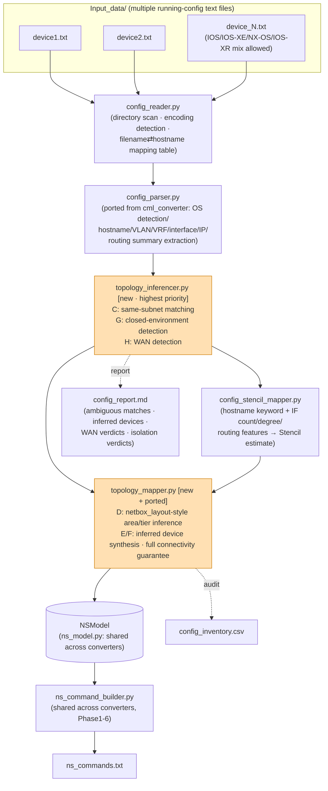

# `config_converter` — Detailed Design & Feasibility Study

> **Purpose of this document**: This is not the implementation itself. It is a multi-faceted
> feasibility and difficulty assessment for introducing a new tool that generates Network Sketcher
> CLI command scripts (`ns_commands.txt`) from raw Cisco device configurations (a bundle of text
> files equivalent to `show running-config` output from multiple devices). After surveying the
> four existing codebases (`template_converter` / `cml_converter` / `3rd_party/netbox_converter` /
> `sna_converter`), it separates reusable logic from parts that require new development specific
> to `config_converter`, and documents concrete algorithm proposals, feasibility assessments,
> difficulty ratings, risks, and unresolved ambiguities for each requirement A through H.

---

## 0. Executive Summary

| Requirement | Summary | Feasibility | Technical Difficulty |
|---|---|:---:|:---:|
| A. Folder layout & implementation conventions | Aligned with `template_converter` | High | Low |
| B. Config parsing logic | Reuse `cml_converter`'s `config_parser.py` | High | Low–Medium |
| C. Same-subnet connectivity inference + degree-similarity matching | New algorithm design | Medium | Medium–High |
| D. netbox_converter-style layout | `netbox_layout.py` is metadata-independent and easy to port | High | Low–Medium |
| E. Inferred device synthesis | Naming/color conventions established repo-wide | High | Low |
| F. Full-device connectivity guarantee (sna_converter-style) | sna uses a template approach; direct port of "full inference" is not possible; design changes required | Medium | Medium |
| G. Closed-environment detection | Static config parsing alone leaves fundamental uncertainty | Low–Medium | High |
| H. WAN detection | No direct precedent; new multi-signal scoring approach proposed | Medium | Medium |

**Overall feasibility**: Medium–High. B, D, and E have high reuse of existing assets and high
feasibility. C, F, G, and H require new algorithms specific to `config_converter`; **G (closed-environment
detection)** is the most difficult due to the fundamental limits of static analysis (actual traffic
reachability cannot be determined without simulation), and **a product-policy decision on the user
side is required regarding how much over-detection risk (incorrectly classifying devices as isolated)
is acceptable**. See §4.7 for details.

---

## 1. Summary of Key Points from Referenced Existing Codebases

### 1.1 `template_converter` — Standard Architecture

`template_converter/` defines the following folder layout (`GUIDE.md` §2).

```
config_converter/
├── README.md                        ← Generated from README.template.md
├── requirements.txt                  ← stdlib only in principle
├── .gitignore                        ← Protects Input_data/Output_data
├── config_converter_to_ns_config.json
├── Input_data/.gitkeep
│   └── sample1/                      ← Bundled Phase-1 reference sample (7 files / 13 devices)
├── Output_data/.gitkeep
└── src/
    ├── __init__.py
    ├── ns_model.py                   ← Copied as-is (shared intermediate model)
    ├── ns_command_builder.py         ← Copied as-is (stencil import only differs)
    ├── convert.py                    ← CLI orchestrator
    ├── config_reader.py              ← Raw config bundle loading (new; equivalent to platform_reader.py.template)
    ├── config_parser.py              ← running-config text parsing (ported from cml_converter)
    ├── topology_mapper.py            ← Same-subnet link inference + NetBox-style layout (new core)
    └── config_stencil_mapper.py      ← Hostname/config features → Stencil
```

The pipeline runs in the order `reader → mapper → stencil_mapper → ns_command_builder → convert.py`.
`ns_model.py` and `ns_command_builder.py` can be **copied without modification**
(only the `platform_stencil_mapper` import line is swapped). Phase 1–6 NS CLI command generation,
the color palette (`(235,241,222)` green = observed network gear / `(255,204,204)` red = server /
`(255,255,204)` yellow = client / `(220,230,242)` blue = observed WayPoint / `(200,200,200)` gray = inferred),
`RULE 0` (vertical hierarchy: WAN=row0, Border/FW=row1, Spine=row2, Leaf/Dist=row3, Access=row4,
Endpoint=row5), `RULE 3` (no direct L1 links between non-WayPoint areas → area merge), and
`RULE 0.5` (column ordering to minimize L1 crossings) can be **applied unconditionally as a
framework shared across all converters**.

`*_to_ns_config.json` uses the form `{"key": {"value":..., "description":..., "sample":...}}`,
and `convert.py` reads only the `value` of each key. `version` and `color_overrides` are
required keys common to all converters.

Reference: GUIDE.md strictly defines the color-coding rules for "observed (from real data) vs.
inferred (pure speculation)" (observed WayPoints are light blue `(220,230,242)`; pure inference is
gray `(200,200,200)`), and **explicitly notes that three converters previously had bugs from
confusing these**. Because `config_converter` relies heavily on "inference" in E, F, G, and H,
this distinction must be enforced from the start.

### 1.2 `cml_converter` — Config Parsing Logic

`cml_converter/src/config_parser.py` is the highest-value existing asset for `config_converter` as
extraction logic that can be reused **as-is from running-config text alone**.

- **Pipeline**: `detect_os_family()` (keyword detection on the first 2000 characters) →
  when CiscoConfParse is available, extract only hostname/VLAN/VRF → **`_extract_interfaces_sectionwise()` is
  the primary path for interface extraction** (content-based scan independent of indentation,
  delimited by `interface` through `!`/blank line/top-level keyword. Handles flattened dumps from
  IOL/CSR, etc.) → `_extract_linux_host_ips()` (for CML Linux nodes; likely unnecessary for
  config_converter) → `_collect_routing_summary()` (collects BGP/OSPF/EVPN/HSRP/VRRP blocks as raw
  text without structuring, up to 2000 lines).
- **Extracted information**: hostname, os_family (nxos/ios/iosxe/iosxr/unknown), VLAN, VRF,
  interface type (physical/svi/loopback/subif/portchannel/mgmt/tunnel/unknown),
  access/trunk VLAN, IP (primary/secondary, both CIDR and mask notation), channel-group,
  MTU/Speed.
- **CML-specific parts that must be separated**: L1 physical links are generated **independently of
  running-config** by `build_l1_links()` matching CML YAML `links[]` (`n1/i1` or
  `node_a/interface_a`) against each node's `interfaces[]` via `_index_cml_interfaces()`, then
  passed directly to `add l1_link_bulk`. `config_converter` has **no such explicit link
  information**, so L1 link inference is the largest new development volume.
- **Limits**: CDP/LLDP, `show version`, and banners are unsupported (CML-specific design that
  depends on `node_definition` as a separate source). `interface range` is skipped. Routing
  protocols are kept only as free-text attributes without structuring. IOS-XR is detected only via
  `detect_os_family()` with no dedicated parser (falls back to the normal IOS path). No ASA/FTD-specific
  logic.
- **`cml_to_ns_config.json` is never referenced from code** (dead config file).
  `config_converter` should be designed so the config file is actually read from code.

### 1.3 `3rd_party/netbox_converter` — Layout Inference Logic

`netbox_layout.py` derives tier (vertical hierarchy) and areas (horizontal grouping) from topology
(L1 links) and device names **without using NetBox site/rack/position for final placement**.
This is an existing asset ideally suited to `config_converter` (no metadata; topology and hostnames only).

- **Area partitioning**: `networkx.connected_components(G)` splits into connected components; each
  component becomes one area (topology-derived, not NetBox site).
- **Tier determination**: `calculate_tier_by_device_role(G, node)` is computed from **hostname
  keywords** (dictionary of wan/edge-router/core/dist/access/endpoint, etc.) + graph degree
  (`G.degree()`, thresholds 1, 4, 8) + WAN keywords in adjacent edge `connection` strings.
  NetBox-specific `device role`-derived tier is **integrated** in `calculate_integrated_tier()` as
  `min(name-based tier, role-based tier)` (**works without it too**).
- **Redundant pair detection**: `detect_device_clusters()` clusters stack/VSS/HA pairs by common
  hostname base name + degree similarity (`abs(degree_i - degree_j) <= max(avg*0.5, 2)`),
  forcing them to the same tier.
- **Column order**: `ns_model._place_columns()` uses a Sugiyama-style layered sweep (median ordering +
  adjacent transpositions) to minimize L1 crossings. Does not use networkx (stdlib only).
  (Note: the `config_converter` copy was strengthened in Phase A by upgrading this one-directional
  sweep to a **bidirectional convergence sweep** and adding **cross-row wire-length minimization**
  to `_order_row()` tiebreaks. See §5 risk #31.)
- **Centrality-based tier (`calculate_tier_by_centrality`) is implemented but not called from the
  actual pipeline** (near dead code), so there is little need to bring complex centrality
  calculations into `config_converter`.
- **Unconnected devices are excluded from placement by default** (controllable via `include_unconnected` config).

### 1.4 `sna_converter` — Inferred Device Synthesis & Connectivity Completion Logic

`sna_converter` assumes "NetFlow CSV contains no device inventory whatsoever," which differs greatly
from `config_converter` (which has a clear device inventory in configs). Therefore the realistic
approach is **"transfer of design philosophy" rather than "direct port"** of sna_converter logic.

- **Handling unknown peers**: sna has no concept of a "known device inventory." External IPs are
  aggregated per `(proto,port)` into `Svc_*` (not device-per-IP), internal IPs below threshold go to
  `out_of_scope_ips.csv` without device creation, clients are aggregated per `/24` into `PC_*` —
  noise reduction through aggregation is the focus, which differs from the one-to-one peer inference
  `config_converter` requires.
- **Actual implementation of full-device connectivity guarantee**: There is **no generic post-processing
  logic** of isolated-node detection → add links. Instead, for each site type (DC/client), a
  **deterministic stack-style infrastructure template** (Edge→FW→Core→Acc1, etc.) is always
  generated, and all observed endpoints are forcibly connected to the access layer of that
  template to achieve "zero isolation."
- **Site inference**: Multi-stage heuristic of `/24`→`/16` aggregation → adjacent `/16` absorption on
  traffic graph → DC/client classification. In `config_converter`, this can be replaced by "config
  area/site information (hostname naming rules, etc.) + connected components of the link graph."
- **Implication**: What `config_converter` can use directly is the idea of "template-style
  infrastructure synthesis" (see §4.6 later); sna_converter has no graph algorithm of "detect
  isolated nodes → search the whole network to infer connection targets." A generic algorithm must be
  newly designed for `config_converter`.

---

## 2. Overall Architecture



### Module Responsibility Table

| Module | Origin | Responsibility |
|---|---|---|
| `config_reader.py` | New (`platform_reader.py.template` pattern) | Directory scan; returns a set of `ParsedConfig`. Resolves filename vs `hostname` line mismatches |
| `config_parser.py` | **Ported from `cml_converter`** (remove unnecessary parts such as Linux host extraction) | One device's running-config text → structured data |
| `topology_inferencer.py` | **New** | C: IP subnet match graph + degree-similarity matching; G: closed-environment detection; H: WAN detection |
| `config_stencil_mapper.py` | Keyword rules from `cml_converter` + ideas from `netbox_stencil_mapper` | Hostname/interface features → NS Stencil |
| `topology_mapper.py` | **Primarily ported from `netbox_layout.py`**, with E/F inference logic added | Area/tier placement, inferred device synthesis, full connectivity guarantee |
| `ns_model.py` / `ns_command_builder.py` | **Copied as-is from `template_converter`** | NSModel definition, Phase 1–6 command generation |

---

## 3. Processing Pipeline (Detail)

```
Phase 0  [config_reader]      Directory scan → {filename: raw_text} → config_parser.parse_all()
Phase 1  [config_parser]      {filename: ParsedConfig} (hostname, os_family, interfaces, vlans, vrfs, routing_summary)
Phase 2  [topology_inferencer] Collect IP addresses from all ParsedConfig → group by subnet
                                → exclude HSRP/VRRP/GLBP virtual IPs → pair via degree-similarity matching
                                → unmatched/solo candidates marked as "unknown peer"
Phase 3  [topology_inferencer] WAN detection (scoring) → among unknown-peer interfaces, mark WAN-like ones
                                as "WAN Cloud" candidates
Phase 4  [topology_inferencer] Closed-environment detection (shutdown / ACL deny-all / null0 route)
                                → skip inferred peer generation for matching interfaces
Phase 5  [config_stencil_mapper] Stencil/Model/OS estimate per device
Phase 6  [topology_mapper]     netbox_layout-style tier/area inference (build graph from matched L1 links only;
                                closed-verdict devices to dedicated isolation area) → add inferred devices
                                (Dummy_<TYPE>_<n>/Dummy_CL_1 WAN cloud) to areas →
                                connectivity guarantee for remaining isolated devices (enabled by default, sna-style template)
Phase 7  [ns_command_builder]  NSModel → Phase 1–6 NS CLI commands
Phase 8  [convert.py]          Output ns_commands.txt / ns_model_config.json / config_inventory.csv /
                                config_report.md / config_excluded_links.csv
```

---

## 4. Requirement-by-Requirement Detailed Design (A–H)

### 4.1 Requirement A — Folder Layout & Implementation Conventions

**Design**

- Adopt the single-mode layout from `template_converter/` (no underlay/overlay split like `aci`/`catc`/`nd`
  — config_converter handles L1/L2/L3 as one unit). Reference implementation:
  `3rd_party/netbox_converter/src/` (single mode, `ns_model.py` already separated, latest design).
- **Delete** `fetch_from_platform.py.template` (config_converter accepts only a local "raw config file
  bundle"; live API fetch is out of scope). If users later want a "helper script to collect
  `show running-config` via TACACS+/SSH," it may be added as a separate tool (e.g.
  `fetch_running_configs.py`, read-only show commands only) — out of scope for this document,
  noted on the roadmap as an optional Phase 5+ extension.
- `Input_data/` is designed to accept a **directory** (other converters take a single JSON/YAML, but
  config_converter's essential input is "multiple files for multiple devices").
  Make `--input <directory>` a required positional argument; scan only top-level `*.txt`/`*.cfg`/`*.log`
  etc. non-recursively (subdirectory scan defaults OFF due to accidental bulk-ingest risk;
  enable with `--recursive`).
- Bundle a small synthetic lab under `Input_data/sample1/` using RFC 5737
  (`192.0.2.0/24`, `198.51.100.0/24`, `203.0.113.0/24`) and RFC 1918 documentation
  combinations (no real device data). The repository ships a single Phase-1 reference set in
  `Input_data/sample1/` (7 files / 13 devices). Additional multi-device corpora used during
  MCP verification are ad-hoc test data and are not bundled with the tool.

**Feasibility assessment**: High  
**Technical difficulty**: Low

#### 4.1.1 Input File Naming Rules, Extensions, and Multi-Device Concatenated Files (Finalized — §8.4 Decision 12)

The following is the finalized design ("allow any extension and any filename; treat config content
itself as the source of truth").

- **No constraints on extension or filename**. By default, scan **all files that can be read as text**
  directly under `Input_data/` (and subdirectories when `recursive_scan` is enabled).
  Filtering is **decode-based**, not an extension whitelist:
  1. Immediately skip extensions that are clearly binary (`.zip`, `.png`, `.jpg`, `.pdf`, `.xlsx`, `.docx`,
     `.exe`, `.dll`, `.pyc`, etc. — defined as `_BINARY_EXT_BLOCKLIST` in `convert.py`).
  2. For all other files, try decoding in order `utf-8-sig` → `utf-8` → `latin-1`; skip and record in
     the report if all fail, content is empty, or `\x00` is present (strong binary signal).
  3. Files that pass are unconditionally passed to the next stage (multi-device split logic below) as
     "text files that may contain one or more device running-configs."
  4. `.gitignore` sample explicit rules (GUIDE.md §4) are maintained independently of this
     extension-agnostic scan policy (the policy of explicitly whitelisting sample files is unchanged).
- **Support all patterns: one file per device / multiple devices per file / a mix**.
  Add `_split_multi_device_blob()` to `_load_config_directory()` in `convert.py` (equivalent to
  `config_reader.py` responsibility) to split file content into multiple device running-configs:
  1. Scan the full file with line-anchored "device boundary marker" regexes (priority: the earliest
     matching line is adopted as the actual boundary):
     - `^Building configuration...` / `^!\s*Current configuration` (IOS/IOS-XE/NX-OS)
     - `^!!\s*IOS XR Configuration` (IOS-XR)
     - `^:\s*Saved` / `^ASA Version` (ASA/FTD — see 4.1.2)
     - `^hostname\s+\S+` (fallback boundary when no prior marker is found.
       The first `hostname` line is treated as part of the file preamble and **not counted** as a
       boundary — only the 2nd and subsequent `hostname` occurrences start a new device).
  2. When two or more boundaries are detected, extract text between boundaries as one device's
     `raw_text`. If none are detected, treat the entire file as one device (fully backward compatible
     with existing "one file, one device" behavior).
  3. Each chunk from splitting goes through the same pipeline as a normal file
     (`detect_os_family()` → `parse_running_config()`). Mixed OS vendors in one file (unusual) are
     judged independently per chunk.
  4. The `label` in `{label: raw_text}` passed to `parse_all()` is, for one file one device,
     `<filename stem>` as before; when splitting occurs, `<filename stem>__<n>` (`n` is 1-based).
     When each `ParsedConfig.hostname` is determined downstream, replace the label with `hostname` as
     canonical (prefer `hostname` when it differs from the filename; record mapping in
     `config_report.md`).
  5. This logic follows cml_converter's tolerant-parse policy of "do not throw on a single-line parse
     failure," guaranteeing a fallback that always returns "at least one device (entire file)" even if
     boundary detection fails (no exceptions thrown).
- **Automatic OS platform detection** applies `config_parser.detect_os_family()` (ported from
  `cml_converter`, see §4.2) to each chunk after splitting. No manual OS override option (fully
  automatic only).
- Files with ancillary command output such as `show tech-support` are limited to the range where
  boundary markers (`Building configuration...`, etc.) are found; other `show` command output blocks
  are effectively ignored by existing `_extract_interfaces_sectionwise()` section boundary detection
  (recognizes blocks only at top-level keywords) — no dedicated skip logic needed; naturally
  neutralized as a side effect of tolerant parsing.

**Risks & edge cases**:
- Directory input is a pattern other converters do not have; it departs from GUIDE.md's implicit
  assumption that "`--input` is export JSON." This deviation must be stated explicitly in
  `config_converter/README.md`.
- Multi-device concatenated file boundary mis-detection risk: rare cases where `hostname` appears
  accidentally in ACL remote definitions or comments cannot be ruled out. Even if over-split, the
  worst case is "one device split into two"; downstream requirement C (same-subnet matching) treats
  each independently, so it is not a fatal failure (at worst one extra inferred device — design
  errs on the safe side).

---

### 4.2 Requirement B — Config Parsing Logic (`cml_converter` Reuse)

**Design**

- Copy `cml_converter/src/config_parser.py` **almost as-is** to `config_converter/src/config_parser.py`
  with these modifications:
  1. Remove `_extract_linux_host_ips()` (CML Linux nodes — alpine/ubuntu boot script only), or keep
     with `--include-linux-hosts` (raw config input might rarely include Linux `ip addr` config files;
     opt-in retention is safer for backward compatibility than deletion).
  2. `detect_os_family()` can be reused as-is. In config_converter it is **used actively** for
     Stencil/Model determination (unused in cml_converter; see §1.2).
  3. Add structured fields for HSRP/VRRP/GLBP virtual IP and group information (currently buried in
     `_collect_routing_summary()` free text; independent fields are mandatory because they are noise
     sources in requirement C subnet matching — see §4.3 edge cases).
  4. Newly structure-parse ACL definitions (`ip access-list` / `access-list`) and interface application
     (`ip access-group <name> in|out`) (required for requirement G).
  5. Newly extract `crypto map` application, `ip nat outside/inside`, `ip address dhcp/negotiated` as
     interface attributes (required for requirement H).
  6. Lightweight parse of `router bgp <asn>` `neighbor <ip> remote-as <asn>`; record neighbors with
     ASN different from local AS as "external BGP peers" (one signal for requirement H,
     best-effort — full BGP config parser is out of scope).

**Feasibility assessment**: High (roughly 80% of core logic works as-is)  
**Technical difficulty**: Low–Medium (only items 4–6 and new additions below are medium difficulty)

#### 4.2.1 Supported OS Scope and Phase 1 Scope (Finalized — §8.3 Decision 7)

**Include IOS-XR / ASA / FTD support in Phase 1** (no deferral). Finalized approach:

- **IOS-XR**: When `detect_os_family()` returns `iosxr`, add dedicated extraction logic.
  `interface Bundle-Ether<N>` (IOS-XR LAG, equivalent to IOS `Port-channel`), commit-model syntax
  differences (candidate config before commit is out of scope — this tool always handles finalized
  `show running-config` equivalent text, so practically no impact), IP addressing under
  `address-family ipv4 unicast`, `!! IOS XR Configuration` header as file boundary marker (§4.1.1).
  Interface extraction reuses existing content-based scan logic by adding IOS-XR-specific top-level
  keywords to `_extract_interfaces_sectionwise()` scan targets (`route-policy`, `prefix-set`,
  `community-set`, etc., boundary additions so non-interface blocks are not confused with interface
  content).
- **ASA / FTD**: **FTD targets only the ASA OS portion of text config (`show running-config`
  equivalent ASA CLI format), so the same parsing logic as ASA applies in practice** — finalized
  (FTD threat-defense policy — access control policy, intrusion prevention rules, FMC/FDM object
  model — is out of scope; only ASA CLI syntax needed for network topology reconstruction:
  `interface`/`nameif`/`ip address`/`route`/`access-list`/`object network`/`nat`, etc.).
  Add `asa` to `detect_os_family()` with signals `: Saved` header, `ASA Version` line, and
  `nameif <zone name>` under `interface GigabitEthernet0/0`. New ASA-specific structured support:
  - `nameif <name>` → add new `ParsedInterface` field `nameif: Optional[str]` as zone name (used in
    Stencil inference and WAN detection — ASA `nameif outside` is a strong WAN signal; see §4.8).
  - Lightweight parse of `object network <name>` / `object-group network <name>` definitions and
    `nat (inside,outside) ...` for requirement H NAT signals (full object model resolution out of
    scope; name presence detection only).
  - ASA ACL (`access-list <name> extended {permit|deny} ...`) fits existing `AclDefinition`/`AclRule`
    structure (same ordered-list structure as IOS).
  - Register syntax that could confuse boundary detection (`same-security-traffic permit inter-interface`,
    etc.) in `_extract_interfaces_sectionwise()` boundary keyword set so interface blocks are not
    misidentified.
- All extensions follow the same pattern: "as supported OS grows, the boundary keyword set in
  config_parser.py expands" — no architectural change. Add to Phase 1 completion criteria (§6):
  "each of IOS/IOS-XE/NX-OS/IOS-XR/ASA/FTD has at least one sample config parsed correctly."

**Feasibility assessment (including IOS-XR/ASA/FTD)**: High–Medium (achievable as extension of
existing content-based scan architecture; advanced features such as zone-based FW remain out of
Phase 1 scope like requirement G)  
**Technical difficulty**: Medium (mainly boundary keyword set expansion and new fields; no fundamental
algorithm change)

#### 4.2.1.1 IOS-XE 3.x (Pre-Denali Integration) — Intentionally Out of Scope · EoL (Cross-Review Response, Finalized)

`detect_os_family()` performs primary classification by `version` major number only (12.x/15.x →
`"ios"`, 16.x/17.x → `"iosxe"`). This approach has a known weakness: **IOS-XE 3.x**
(pre-"Denali" generation, first-gen ASR1000/ISR4000 series, etc.) self-reports as `version 15.x` in
`show running-config`, so this `version` heuristic alone cannot distinguish it from classic IOS.

**Decision (agreed with user)**: IOS-XE 3.x is an End-of-Life platform generation declared by Cisco;
this tool is **formally unsupported**. **Do not intentionally add** special branching to distinguish
IOS-XE 3.x from classic IOS when both report `version 15.x` — doing so would introduce new
misclassification risk against true classic IOS devices (also self-report `version 15.x` and are
formal Phase 1 support targets), which is not worth it.

**Current actual behavior (recorded honestly)**: If an IOS-XE 3.x config file is input, this tool
does not reject or error. It simply misclassifies as `"ios"` (classic IOS) and continues. To avoid
the misconception that it is "blocked," document this known limitation in the README.md "Supported OS
versions" section.

Supported OS version summary (also copied to `README.md`):

| OS Family | Supported | Excluded |
|---|---|---|
| IOS-XE | "Denali" integration and later (16.x/17.x series) only | IOS-XE 3.x (EoL; self-reports `version 15.x` → misclassified as classic IOS) |
| IOS | 12.x/15.x series (classic IOS) | — |
| NX-OS / IOS-XR / ASA(FTD/FDM) | No specific version threshold (boundary-marker-based detection) | — |

#### 4.2.1.2 ASA/FTD/FDM Unification — Display Name Consolidation Based on MATCHA Research (Cross-Review Response, Finalized)

**Background**: Historically `detect_os_family()` returns only a single internal value `"asa"`
(signals: ASA `: Saved` header / `ASA Version` line). Meanwhile `stencil_mapper.py` had an override
rule that outputs `Model="Cisco FTD"` only when hostname contains `"ftd"`, and a firewall condition
`os_family in ("asa", "ftd")`, but `detect_os_family()` structurally cannot produce `"ftd"`, so the
latter `"ftd"` branch was effectively unreachable dead code. Whether ASA and FTD should be treated
as separate display entities (distinguishable at config syntax level) had also not been verified.

**Research method**: Asked `user-matcha` (Cisco technical document RAG server) three focused questions
on how identical ASA/FTD/FDM `show running-config` equivalent CLI output is.

1. "Does FDM-managed FTD produce the same `show running-config` output as classic ASA?" →
   confidence **0.773**. Answer: not a complete 1:1 — ACL/NAT/intrusion prevention and other
   policy-based features are managed on the FDM GUI/policy engine side and do not appear in CLI
   output (source: `fptd-fdm-config-guide-10-0.pdf` p.880-881).
2. "Are FTD diagnostic CLI (LINA engine) `interface`/`nameif`/`ip address`/`route` command syntax
   completely identical to classic ASA?" → confidence **0.790**. Answer: **Yes** — these core
   networking syntaxes are identical to ASA. However ACL/URL Filtering/application inspection and
   other policy features are managed on a separate layer and do not appear in `show running-config`
   (source: same, and `management-center-admin-10-0.pdf` p.510).
3. "Does standalone FDM-managed FTD (no FMC) have the same LINA/ASA syntax CLI as FMC-managed FTD?"
   → confidence **0.761**. Answer: **Yes** — under both FDM and FMC management, the underlying LINA
   engine provides the same `show running-config` verification command set (source:
   `fptd-fdm-config-guide-10-0.pdf` p.913).

**Conclusion and decision**: All three at ~0.7 confidence (medium–high; MATCHA server guidance
treats ≥0.7 as presentable high-reliability evidence) confirmed that **within what this tool
actually reads** (interface names/IP/`nameif`/BGP neighbors, etc. — L1–L3 structure needed for
topology restoration), ASA, FMC-managed FTD, and FDM-managed FTD output **the same ASA/LINA CLI
syntax**. Differences exist only in ACL detail and policy-based features (originally outside this
tool's parse scope), which do not affect this tool's scope.

Based on this evidence, **decided to treat ASA/FTD/FDM as a single unified display label
"ASA(FTD/FDM)"** (rejected "ASA(FTD)" only — FDM LINA CLI confirmed identical). Internal
`os_family` value remains `"asa"`; do not create `"ftd"` (`detect_os_family()` cannot generate it;
no point having it only in type hints). Updated both `stencil_mapper.py` display mapping
(`OS_FAMILY_DISPLAY`) and hostname heuristics (`HOSTNAME_KEYWORD_RULES` `"asa"`/`"ftd"` entries) to
this unified label.

#### 4.2.2 Adding `ciscoconfparse2` Dependency (Finalized — §8.3 Decision 10)

Add `ciscoconfparse2` as an **optional (soft) dependency** in `requirements.txt`
(follow `cml_converter/src/config_parser.py` `_HAVE_CCP` flag pattern as-is — version pin aligned
with `cml_converter/requirements.txt` `ciscoconfparse2>=0.7.0`). When installed, hostname/VLAN/VRF/ACL
extraction accuracy improves; when absent, fall back to existing regex-based
`_parse_with_regex()`/`_extract_interfaces_sectionwise()` — same "works without it" design as
cml_converter.

**Risks & edge cases**:
- `_extract_interfaces_sectionwise()` `_SECTION_BOUNDARY_RE` is based on IOS/IOS-XE/NX-OS top-level
  keywords; ASA-specific syntax (`same-security-traffic`, `object network`, `nat (inside,outside)`, etc.)
  and IOS-XR hierarchical syntax may misidentify section boundaries. Mitigated by boundary keywords
  added in 4.2.1, but full coverage assumes continuous expansion validated against real data.
- Zone-Based Firewall (ZBFW) and advanced policy features managed by FMC remain out of Phase 1 scope
  (same reason as requirement G §4.7 — complex syntax, high misclassification risk).

---

### 4.3 Requirement C — Same-Subnet Connectivity Inference + Degree-Similarity Matching

This is the core of `config_converter` and the part with the highest degree of novelty.

#### 4.3.1 Problem Formulation

1. Collect a list of `(device, interface, ip, prefixlen)` from all devices and all interfaces.
2. Group by **network address** as key (`ipaddress.IPv4Network(f"{ip}/{prefixlen}", strict=False)`).
   Interface sets sharing the same network address + same prefix length are called "subnet candidate
   groups."
3. Branch by element count `k` of each subnet candidate group:
   - **k = 1**: No peer device exists in the input config set → proceed to **requirement E (inferred device synthesis)**.
   - **k = 2**: Pair is uniquely determined → treat as L1 link candidate as-is (only validity checks in 4.3.4 below).
   - **k ≥ 3**: **Solve which two devices are actually linked as a matching problem** (main topic of this section).
     Mathematically, this is formulated as a "minimum-cost matching" problem on a complete graph with k nodes.

#### 4.3.2 Matching Cost Function

As requested by the user, adopt the heuristic "prefer the pairing whose count of connections outside the target subnet is closer" as the cost function.

```
degree(x) = number of interfaces on device x that belong to subnets other than this one
            (= total occurrences of x across all other subnet groups.
              Whether loopback/SVI/management interfaces are excluded from normal physical adjacency counts can be made configurable)

cost(i, j) = |degree(i) - degree(j)|      (i, j are distinct interfaces within the same subnet candidate group)
```

**Intuitive rationale**: In real networks, both ends of a point-to-point link are often devices with similar roles (e.g., uplinks between core switches, an access switch and its immediate uplink neighbor). Degree (total interface count) serves as a coarse proxy for role, so pairing two devices with similar degree is preferred.

#### 4.3.3 Inferred L2 Switch Placement Gate (L2 switch inference gate, confirmed/new, §8.1 Decision 3)

Expressing L2-only connections (trunk/access ports without IP) is out of scope; the confirmed policy is to **limit estimation to IP reachability**. However, design new logic to decide, when multiple real interfaces are found on the same subnet, whether they are truly point-to-point links or a shared LAN segment with a (config-less) L2 switch in between. This gate runs immediately after subnet candidate grouping in 4.3.1 and **before** 4.3.4 (formerly 4.3.3, matching algorithm).

**Decision logic**:

```
group = one subnet candidate group (network/prefixlen, candidates[], k=len(candidates))
has_virtual_ip = whether any candidate in the group has an HSRP/VRRP/GLBP virtual IP on the same subnet
is_large_subnet = prefixlen <= large_subnet_prefix_threshold   (default 24; refers to subnets such as /24, /23, /22
                    that clearly have more spare IP addresses than typical point-to-point links (/30, /31, /29, etc.))

IF k == 2 AND NOT has_virtual_ip AND NOT is_large_subnet:
    → "Direct connection" (NO_L2_INFERENCE). Treat the two candidates as a point-to-point link as-is
      (only 4.3.5 validity checks; no L2 switch is generated).
ELSE:
    → "L2 segment" (L2_SEGMENT_REQUIRED). At least one of the following applies, so an L2 switch is assumed in between:
        - k >= 3 (multiple candidates on the same subnet)
        - has_virtual_ip (HSRP/VRRP/GLBP redundancy always goes via an L2 switch)
        - is_large_subnet (large subnets such as /24 are not used for point-to-point links)
      → Proceed to 4.3.6 "Shared LAN segment resolution".
```

**Intuitive rationale**: In real networks, point-to-point links (WAN circuits, direct router interconnections, etc.) are typically built with small subnets such as `/30`, `/31`, and `/29`. Using a large subnet such as `/24` for point-to-point between only two routers is unrealistic (many unused addresses on the same subnet strongly suggests a LAN segment that would host other hosts via a switch). Similarly, HSRP/VRRP/GLBP are by definition redundancy under an L2 switch, so a virtual IP is direct evidence that an L2 switch must exist.

**Configuration keys**: `l2_inference_enabled` (default `true`) enables/disables this gate; `large_subnet_prefix_threshold` (default `24`) sets the "large subnet" threshold. Both are configurable via `config_converter_to_ns_config.json` (see §7).

#### 4.3.4 Algorithm Candidate Comparison (formerly 4.3.3)

When k≥3, candidate matching algorithms to determine which two devices are actually linked are as follows. They apply to groups judged `L2_SEGMENT_REQUIRED` by the 4.3.3 gate that could not be resolved by 4.3.6 "real config first".

| Algorithm | Description | Complexity | Pros | Cons |
|---|---|---|---|---|
| **(a) Greedy** | Sort all pair `cost` values ascending; greedily fix pairs from unused nodes | O(k² log k) | Simple to implement, deterministic | Prone to local optima (early fixed pairs can worsen total cost later) |
| **(b) Full pair enumeration (brute-force perfect matching)** | Enumerate all ways to partition k nodes into pairs; adopt the partition with minimum total cost | O(k!) (exactly (k-1)!! = double factorial) | Guarantees global optimum | Explodes as k grows (945 for k=10, 135135 for k=14) |
| **(c) Minimum-weight perfect matching (Blossom algorithm)** | Minimum-weight maximum matching on a non-bipartite graph; use `networkx.algorithms.matching.min_weight_matching` | O(k³) | Global optimum in polynomial time; practical for large k; `networkx` is already a required dependency from Phase 1 per D requirement, so marginal cost is effectively zero | Slightly higher implementation understanding cost |

**Adoption policy (confirmed, §8.3 Decision 9)**: Formally allow `networkx` dependency and **adopt the Blossom algorithm (`networkx.algorithms.matching.min_weight_matching`) as the default and preferred matching method** (a decision, not a comparison item). Reason: D requirement (§4.4) netbox_layout port already requires `networkx`'s `connected_components`/`degree`/`neighbors`, so `networkx` is already a Phase 1 required dependency and marginal cost of Blossom is effectively zero. Change default of `matching_algorithm` to `"blossom"` (see §7). Brute force (b) remains **only as fallback** when `matching_algorithm: "brute_force"` is explicitly set or `networkx` cannot be loaded at runtime (unchanged: if `max_candidates_for_brute_force`, default 8, is exceeded, skip brute force and automatically fall back to 4.3.6 shared LAN segment handling). Greedy (a) sacrifices optimality for simplicity, so use it **only as auxiliary tie-break information** (described below).

**Tie-break rules** (when costs are equal):
1. When multiple candidate pairs share the minimum cost, apply a deterministic rule: form pairs by **lexicographic hostname order** (to guarantee reproducibility across runs).
2. Furthermore, if an interface `description` field contains the peer hostname or interface name, prioritize that pair (treated as a stronger signal than the degree heuristic).
3. If still tied, use stencil hierarchy proximity from `config_stencil_mapper` as a third tie-break (e.g., prefer L3Switch–L3Switch; avoid asymmetric pairs such as L3Switch–PC).
4. If still unresolved, **list both pairing candidates in the report, lower confidence, and deterministically select one** (so the user can visually verify in `config_report.md`).

#### 4.3.5 Post-Pairing Validity Checks (formerly 4.3.4)

- If prefix lengths differ on both interfaces (mask mismatch misconfiguration), warn as "possible subnet mismatch" but still include in matching candidates as long as network addresses match (tolerate real-world misconfigurations).
- Exclude cases where two interfaces on the same device share the same subnet (self-loop or HSRP mis-detection).
- After matching, **contradictory candidate pairs representing the same physical link** (e.g., both A–B and A–C score highly but A has only one physical port) are difficult to cross-validate from config alone, so Phase 1 does not implement this—since `config_parser` provides individual interface names, the constraint "one interface = one link" is automatically enforced.

#### 4.3.6 Resolving "L2 Segment" Groups (formerly 4.3.5, confirmed/revised, §8.2 Decision 4)

Resolve subnet candidate groups judged `L2_SEGMENT_REQUIRED` by the 4.3.3 gate (including k=2 cases triggered only by HSRP/large subnet) with the following priority (because the NS L1 model can only represent point-to-point links, shared LAN segments must always be represented as a **star centered on one L2 switch (real or inferred device)**).

**Priority 1: Real config first (confirmed/new)** — If among candidates in the group there is a device identifiable as an L2/L3 switch (`config_stencil_mapper` result `Switch`/`L3Switch`) and its own config structurally indicates it is the real hub for this subnet (e.g., SVI for the VLAN plus physical/access ports assigned to the same VLAN), **adopt that device as the real hub** and connect all remaining candidates as direct links to it (no new device generated). If this cannot be determined, proceed to priority 2.

**Priority 2: Resolution via `shared_subnet_strategy` (default `best_pair`)** — When priority 1 cannot identify a real hub:

- **When k ≥ 3**: Follow `shared_subnet_strategy`.
  - `"best_pair"` (**default**): Use degree-approximation matching (4.3.2 cost function) to adopt only the best single pair as a real link; remaining candidates go to E requirement (§4.5) inferred device generation (each may become a separate inferred peer such as `Dummy_RT_n`).
  - `"synthetic_switch"`: Generate one inferred L2 switch `Dummy_L2_<n>` (§4.5 naming) and star-connect all candidates to it.
- **When k == 2 (L2 segment judged only due to HSRP/large subnet)**: No ambiguity about which two to pair (only two candidates), so `shared_subnet_strategy` branching does not apply. **Always generate one inferred L2 switch `Dummy_L2_<n>` and star-connect both candidates** (do not represent the two as a direct point-to-point link—consistent with the 4.3.3 gate judgment that an L2 switch exists in between).

**Feasibility assessment**: Medium (algorithm is established techniques combined; validity of "degree" proxy and "real hub" logic needs validation on real data)
**Technical difficulty**: Medium–high (many design choices for many-to-many ambiguity, thresholds, tie-breaks)

**Risks and edge cases** (including user-specified additional considerations):
- **HSRP/VRRP/GLBP virtual IPs**: When real interface IPs and virtual IPs coexist on the same subnet, virtual IPs are not bound to a specific physical interface (they move on failover), so they must be **explicitly excluded** from degree calculation and matching (reason for separating virtual IPs in §4.2 extended parse). Mixing virtual IPs into degree matching risks a pair of two devices appearing as three and being misclassified as a shared segment.
- **Sub-interfaces/SVI/trunk ports**: Sub-interfaces (`GigabitEthernet0/1.10`) are separate L3 entities from parent physical interfaces (reuse `cml_converter`'s `NSSubInterface` model). Trunk ports usually have no IP, so subnet matching targets SVI/sub-IF/routed physical port IPs. Trunk peer detection (L2 adjacency) cannot be detected by IP matching; **config_converter L1 link inference is limited to L3 (IP) reachable links; pure L2 trunk connections (SW–SW trunks without IP) are fundamentally undetectable** (also noted in general risks below).
- **EtherChannel/LAG** (confirmed/revised): Because Network Sketcher treats ports not explicitly wired as physical links as "unused (unrecognized)", when IP is assigned to a Port-channel logical interface, perform subnet matching on that IP (peer Port-channel pairs are determined by normal subnet matching in C requirement 4.3.1–4.3.6), and wire **every physical member port composing the Port-channel individually to every physical member port on the peer side**. Withdraw the prior simplification of "represent only one representative port as the real link and keep remaining members as internal Port-channel info only" (Network Sketcher would show unwired physical ports as unused, so the representative-port approach would not reflect remaining members on the diagram). `cml_converter`'s `NSPortChannel` model (`physical_ports: List[str]` per `device` = list of local member physical port names) can be reused as-is—this model need not store peer correspondence (correspondence is expressed by the generated `NSL1Link` set); it already has enough information by aggregating members from each device's `ParsedInterface.channel_group` into `physical_ports`, so no extra fields are needed for the new policy.

  **Member port peer pairing algorithm**: After both Port-channel logical interfaces are confirmed as peers by subnet matching, pair local member set `local_members` and peer member set `peer_members` one-to-one by the following steps and generate a separate `NSL1Link` (real link) per confirmed pair (do not draw L1 links on the Port-channel logical interfaces themselves).

  ```
  # Preprocessing: normalize each member interface name to a numeric tuple of
  # module/slot/port parts (e.g. 'GigabitEthernet1/0/1' -> (1, 0, 1),
  # 'TenGigabitEthernet2/0/1' -> (2, 0, 1)). Reuse existing interface name parse
  # regex (config_parser) / normalise_port_name() numeric extraction logic.

  remaining_local = set(local_members)
  remaining_peer  = set(peer_members)
  pairs = []

  # Step 1: exact match first — pair members whose module/slot/port numbers match exactly
  #         on both ends with highest priority (e.g. local Gi1/0/1 and peer Gi1/0/1).
  for lm in sorted(remaining_local, key=numeric_id):
      pm = next((p for p in remaining_peer if numeric_id(p) == numeric_id(lm)), None)
      if pm is not None:
          pairs.append((lm, pm))
          remaining_local.discard(lm); remaining_peer.discard(pm)

  # Step 2: for remaining unmatched members, greedily pair by "close number" rule
  #         (e.g. local 1/0/1 and peer 2/0/1 ordered by closeness of trailing port number).
  #         cost = (absolute difference of trailing port numbers, lexicographic distance of full numeric tuple);
  #         fix pairs in ascending cost order (same idea as 4.3.4 tie-break rules;
  #         ties resolved deterministically by lexicographic hostname/interface name order).
  while remaining_local and remaining_peer:
      lm, pm = argmin over (l, p) in remaining_local x remaining_peer of
               (abs(last(numeric_id(l)) - last(numeric_id(p))),
                tuple_distance(numeric_id(l), numeric_id(p)))
      pairs.append((lm, pm))
      remaining_local.discard(lm); remaining_peer.discard(pm)

  # Step 3: asymmetric configuration (member counts differ on both ends).
  leftover_local = remaining_local   # non-empty only when len(local_members) > len(peer_members)
  leftover_peer  = remaining_peer    # non-empty only when len(peer_members) > len(local_members)
  ```

  - Each pair fixed in steps 1–2 is output from `infer_l1_links_from_subnets()` as one `NSL1Link` per pair, same as links from normal subnet matching.
  - **Asymmetric configuration (different member counts)**: Each member in `leftover_local`/`leftover_peer` from step 3 is handled exactly like a normal "unknown peer" interface and passed to E requirement (§4.5) inferred device generation (each surplus member connects to a separate inferred peer such as `Dummy_RT_n`; when `aggregate_access_peers` is enabled, surplus members on the same device may be aggregated into one—in line with other unknown-peer interfaces to stay consistent with E/F inferred device logic).
  - Note this algorithm is a **downstream process** independent of C requirement k≥3 matching (4.3.4) and the L2 switch inference gate (4.3.3): which two Port-channels link is resolved first by normal subnet matching; this algorithm only handles **member physical port correspondence after those two devices are known**.
  - **When peer Port-channel/device is not in the input config set (added/confirmed, user request)**: The peer pairing algorithm above applies when the peer Port-channel logical interface was confirmed by C requirement subnet matching (peer config exists in input). For Port-channel candidates judged k=1 in 4.3.1 (no other candidates on the same subnet; peer device config not in input), they go to E requirement (§4.5) like other unknown-peer interfaces, but **instead of wiring only a single representative link to an inferred device, generate one inferred device with as many inferred interfaces as local Port-channel member physical ports and wire each local member port one-to-one to those inferred interfaces**.
    - Inferred device naming follows §4.5.1 (type code from §4.5 stencil inference priority, default `Dummy_RT_<n>`). Inferred interface names use existing inferred device interface naming (`Dummy 0`, `Dummy 1`, ... zero-based sequence)—no Port-channel-specific naming.
    - Map local members to inferred interfaces mechanically one-to-one in the same order as step 1 preprocessing (numeric tuple, ascending)—peer unknown so number match/approximate pairing does not apply (difference from when peer exists).
    - Thus **whether peer exists (number match first → approximate pairing) or peer is unknown (inferred device), the principle that all Port-channel member physical ports must be wired somewhere is consistently maintained** (Network Sketcher treats unwired physical ports as unused, so do not simplify to wiring only one representative port when peer is unknown).
    - Even when `aggregate_access_peers` (§4.5/§7) is enabled, **do not aggregate members of the same Port-channel into one link** (that option bundles multiple different unknown-peer interfaces onto one inferred device; it does not reduce member count of a single Port-channel).
    - In `config_inventory.csv` confidence/reason columns (§4.5), in addition to normal unknown-peer reasons, record member count explicitly, e.g. `"port-channel member count=<N>, all members individually connected to one inferred peer"`, for audit distinction.
- **Multiple sites reusing the same private range under NAT** (confirmed/revised, §8.2 Decision 5):
  This is the **greatest mis-detection risk** in this design. For example, if sites A and B both use `192.168.1.0/24`, routers from both sites may be misjudged as "same subnet" and geographically unrelated devices may be generated as L1 links.
  The following mitigations are confirmed design (exclusion CSV detailed in 4.3.9 is central):
  1. **Site hint mechanism**: Treat input directory subfolder structure (e.g. `Input_data/site_a/*.txt`, `Input_data/site_b/*.txt`) or filename prefixes as site identifiers; provide an option to **exclude automatic linking between devices with different site hints even if they share the same subnet** (`site_scoping` key in `config_converter_to_ns_config.json`, default OFF = one exploration space for all; recommend ON when user organizes by site subdirectories).
  2. **Post-duplicate-detection exclusion and CSV recording (confirmed)**: When the same RFC1918 subnet spans multiple disconnected components (multiple sites when `site_scoping` enabled) and candidate devices/interfaces **have no distinguishing information other than the duplicated private IP** (no `description` hints, no ACL/NAT clues, no `site_scoping` separation), **exclude from NS command rendering (both L1 links and inferred device generation)** and record in `config_excluded_links.csv` as "out of rendering scope" (schema in 4.3.9). Modeled after `sna_converter`'s `out_of_scope_ips.csv` (mechanism to park unadopted candidate server IPs with reasons, §1.4/3.1), following the conservative default of "prefer auditable exclusion over automatic link over-detection (wrong L1 links)".
  3. **NAT configuration consideration**: When `ip nat inside` is set on an interface, mark subnets under it as "NAT inside (private, not visible externally)" and greatly lower trust in subnet matches between different `ip nat inside` domains (= different NAT device domains) (used as one distinguishing factor in item 2). However, judging "same NAT device or not" from config alone is not obvious, so this remains supplementary.
  **Even with these mitigations, README/reports must state limits of fully automatic judgment outside public IPs.**

#### 4.3.9 Cross-Site Private Range Duplication — Exclusion CSV Schema (confirmed/new, §8.2 Decision 5)

Referencing `sna_converter`'s `out_of_scope_ips.csv` (columns: `ip,region,reason,max_port_bytes, total_bytes,top_port,distinct_clients` — generated by `sna_to_ns_commands.py` to audit excluded candidates with reasons), introduce the following CSV for config_converter-specific exclusions (per candidate "link").

**Filename**: `config_excluded_links.csv` (under `Output_data/`, like other outputs)

**Column layout**:

| Column | Content |
|---|---|
| `subnet` | Network address where duplication was detected (e.g. `192.168.1.0/24`) |
| `device` | Excluded candidate device name (filename/hostname) |
| `interface` | Excluded candidate interface name (raw name before NS normalization) |
| `ip` | IP address of that interface |
| `site_hint` | Site identifier when `site_scoping` enabled (subdirectory name). `(none)` when disabled |
| `duplicate_with` | Other candidate set claiming the same subnet (`device:interface(site_hint)` semicolon-separated) |
| `reason` | Fixed reason string. Example: `"cross-site RFC1918 subnet reuse; no distinguishing evidence (site_scoping/description/NAT) available"` |
| `confidence` | Exclusion confidence (0.0–1.0; usually low to medium depending on duplication likelihood) |

**Generation conditions**: After running the 4.3.3 L2 switch inference gate and 4.3.4/4.3.6 matching normally, if **two or more disconnected components on the matching result graph share the same RFC1918 subnet** and candidates have no distinguishing material (`description` match, `site_scoping`, NAT inside/outside differences, etc.), **exclude all candidates** for that subnet from NS command generation and output one row per candidate to this CSV. Excluded candidates are not subject to E requirement (inferred device generation) or F requirement (full connectivity guarantee) ("may exist but cannot identify which device"—do not even generate inferred peers, as that would imply wrong adjacency). Summarize exclusion count in `config_report.md` and direct users to this CSV for detail.
- **Redundancy (stack/VSS/HA pair)**: Physically two devices appearing as one logical device (VSS, StackWise Virtual, HA pair) often exist as separate config files (separate hostnames). Stack links between them are usually private internal links (often without IP), so **subnet matching cannot detect them**. `netbox_layout.py`'s `detect_device_clusters()` (common hostname base + degree similarity to detect stack/VSS/HA pairs and force same tier) can rescue tier placement, but **generating the physical link between them as L1 commands is only supported in limited cases when config contains that information (e.g. `switch virtual domain`, `stack-mac persistent`, etc.)** (Phase 2 onward).
- **Incomplete/missing config**: When some device configs are not provided (e.g. only 25 of 30 devices), the missing five are automatically supplemented by "unknown peer" = E requirement inferred device generation (requirement C and E are tightly coupled).
- **Scalability at large scale**: Hundreds of devices can mean thousands to tens of thousands of IP addresses. Subnet grouping is `O(n log n)` (dictionary sort), but per-group matching at `O(k!)` (brute force) risks explosion when many candidates concentrate on one subnet (abnormal cases such as misconfiguration sharing one subnet across many devices). **Mandatory safety valve: when upper limit `max_candidates_for_brute_force` (default 8) is exceeded, automatically fall back to shared segment handling.**

**Remaining implementation detail decisions (decisions complete; should be documented in code comments at implementation time)**:
- What to include in "degree" definition (physical ports only vs. SVI/loopback, whether shutdown ports count) remains detailed design in implementation phase; within 4.3.2 default (approximation of physical adjacency degree is sufficient); not a user-approval policy decision like §8.

**Items confirmed in §8 (reflected in this section)**:
- Resolution policy for k≥3 (and applicable k=2) shared subnets → 4.3.6 (§8.2 Decision 4).
- Cross-site same private range handling (record in exclusion CSV) → risk list above and 4.3.9 (§8.2 Decision 5).
- L2-only trunk connections out of scope; limit to IP reachability estimation → 4.3.3 L2 switch inference gate (§8.1 Decision 3).

---

### 4.4 Requirement D — netbox_converter-Style Layout Application

**Design content**

Because `netbox_layout.py` is nearly metadata-agnostic (see §1.3), it is **largely portable as-is**.

1. **Input replacement**: Replace `links` in `netbox_layout.compute_network_groups_and_tiers(links, stencil_tiers)` with the list of `NSL1Link` confirmed by requirement C (real matching only; inferred devices added after E requirement step). Use `_TIER` dictionary from `config_stencil_mapper` (reuse `template_converter`'s `_TIER`: Cloud=0, Router/FW=1, WLC=2, L3Switch=3, Switch/AP=4, Server/PC/Phone=5).
2. **Area = connected component** policy is inherited. For config_converter, when **site hints** (introduced in 4.3.6 NAT mitigation) exist, **warn when connected components contradict site hints** (e.g. devices with same site hint split into two components = possible missing connectivity). Devices judged "fully closed" by requirement G (§4.7) are excluded from this connected-component analysis and area assignment and placed in a dedicated isolated area (see §4.7, Decisions 2/6).
3. **Tier keyword dictionaries**: `netbox_layout.py` dictionaries `wan_keywords` / `edge_router_base_keywords` / `core_keywords` / `endpoint_keywords` etc. are hostname-based and portable. Additionally, device types from `config_stencil_mapper` (Router/L3Switch/Switch etc., inferred from `os_family` and interface layout) supplied as `stencil_tiers` provide a hostname-independent backup signal (`calculate_integrated_tier`'s `min(name tier, stencilTier)` logic works as-is).
4. **Column order (Sugiyama-style layout)**: Use `ns_model._place_columns()` as-is (copying `template_converter/src/ns_model.py` brings it automatically).
5. **Inferred device tier**: Inferred devices from requirement E (`Dummy_<code>_<n>`, WAN Cloud, etc.—naming §4.5 Decision 11) participate in the same graph as real devices; `calculate_tier_by_device_role`'s `degree==1` → tier7 (endpoint treatment) naturally places most inferred peers (degree 1) at the edge.

**`networkx` dependency and Blossom adoption (confirmed, §8.3 Decision 9)**: `netbox_layout.py` depends on `networkx` (`connected_components`, `degree`, `neighbors`). This document **formally allows this dependency and makes `networkx` a required config_converter dependency (legitimate exception to GUIDE.md "stdlib only in principle"—precedents: `cml_converter` PyYAML, `3rd_party/netbox_converter` networkx)**. Building on D requirement's `networkx` dependency, **use Blossom algorithm (`networkx.algorithms.matching.min_weight_matching`) preferentially for C requirement (§4.3.4) k≥3 matching**—this is confirmed design, not comparison outcome. (Stdlib-only brute force remains only when networkx unavailable.)

**Feasibility assessment**: High
**Technical difficulty**: Low–medium (mostly copy/port; need to evaluate impact of config_converter-specific "site hints" and "stencil_tiers accuracy lower than NetBox real data")

**Risks and edge cases**:
- Hostname keyword dictionaries are English/technical-keyword based (`core`, `dist`, `access`, `edge`, etc.). **Japanese and other non-English localization is confirmed unnecessary for all processing in this tool** (§8.4 Decision 13—not only hostname dictionaries; all keyword dictionaries including WAN and stencil judgment target English/technical terms only). Organization-specific naming (site code + function code conventions) continues to be covered by `role_keyword_overrides` (English keyword additions only, §7) and structural fallbacks in `config_stencil_mapper` (interface count, routing protocol presence, etc.).
- Config has interface counts as direct metadata for "degree", but this does not always match physical role importance (e.g. access switch with 48 access ports looks high-degree but only 1–2 uplinks build IP-layer connectivity). Distinguish "physical adjacency degree for subnet matching" (C requirement context) from "graph degree for tier judgment" (D requirement context—the latter is count of confirmed L1 links per netbox_layout.py design, which is fine). The former (C requirement matching degree) is "logical connection count per subnet"; document both definitions clearly at implementation to avoid drift.

**Items confirmed in §8 (reflected in this section)**:
- Allow `networkx` dependency and prefer Blossom algorithm → this section (§8.3 Decision 9).
- Japanese support unnecessary for hostname/WAN/stencil keyword dictionaries → this section (§8.4 Decision 13).

---

### 4.4.1 Area Grouping — WayPoint-Excluded Connected Components (feature)

**Purpose (user requirement)**: "Group each continuously wired cluster of real devices into its own independent Area and lay them out side by side. Exclude WayPoints (cloud/`Dummy_CL_*`) from bridging groups. Devices with no L1 wiring are grouped into a single Closed area representing an isolated environment."

**Policy (decision)**: Area = **connected component of the non-WayPoint subgraph**. Legacy §4.4 used connected components of the **single graph including cloud edges** from `compute_network_groups_and_tiers()` as areas, so shared cloud WayPoints (`Dummy_CL_1`, `NS_CLOUD`) bridged separate real device groups into one area, collapsing to a single `default`. This feature computes connected components **after dropping all links touching WayPoint nodes** for area determination only (`layout.compute_area_components()`). Each continuously wired non-WayPoint cluster becomes its own side-by-side independent area.

**Separation of tier (row) and area (column)**: **Tier/rows are still computed on the full graph including cloud edges per §4.4** (WAN/cloud adjacency of edge routers legitimately affects tier; do not regress). Only area (column grouping) uses the WayPoint-excluded graph. Both are handled separately in `topology_mapper.build_model()` (tier/rows step 5, area step 8.6 described below).

**Pipeline position (step 8.6, important)**: Area assignment runs **after step 7.5 (Port-channel member link synthesis), step 8 (L2/L3 injection), and step 8.5 (Dummy mirror)** on **finalized `model.l1_links`**. Reason: during MCP verification, access/distribution switches in ad-hoc Port-channel corpora (not bundled in the repo) whose **only L1 link is a Port-channel member link synthesized in step 7.5** appear linkless at step 5 and would wrongly fall into "Closed". Delaying to step 8.6 classifies them into the correct continuous wiring group (segment). Tier/rows are fixed at step 5 (before step 7.5, full graph with cloud edges), so Port-channel member sibling links do not disturb tier scale; row placement across verification corpora remained byte-identical.

**Three device classifications (step 8.6)**:
1. **Devices in a non-WayPoint connected component** → that component's area (`default` or `segment_NN`).
2. **Real devices wired only to WayPoints** (have links but not continuously connected to other real devices) → size-1 area of that device alone (wired, so not "Closed").
3. **Devices with no L1 links at all** (e.g. linkless routers `S1`/`S2` in an ad-hoc verification corpus—no L3-addressed interfaces, not matching candidates) **and** devices judged fully closed by requirement G (§4.7) → **single shared "Closed" area** (`isolated_area_name`, sorted rightmost column).

**Area naming scheme (deterministic, reviewable)**:
- When there is **only one** non-WayPoint connected component → legacy name **`default`** (most samples; no rename if split unnecessary = backward compatible).
- When **multiple** → each component gets **`segment_NN`** (`NN` zero-padded). Order is deterministic: **(component size descending, then minimum device name ascending)**.
- Closed/linkless → **`Closed`** (default `isolated_area_name`; changed from legacy `"isolated"` in this feature, see §4.7.1).

**New `layout.compute_area_components(links, waypoint_devices)`**: Build subgraph excluding links touching WayPoint nodes with `build_graph()`, return `nx.connected_components()` sorted by `(size descending, min(name))`. Linkless/WayPoint-only devices are not in the return value (step 8.6 caller handles classifications 2/3). Identify `waypoint_devices` by `stencil_type == NS_CLOUD` (defensively also `Dummy_CL` name prefix).

**Live verification (Network Sketcher MCP, `build_default_outputs` 6/6 success)** — during development, using **ad-hoc synthetic multi-device corpora not bundled in the repo** (historical external workspaces; not `Input_data/sample1/`):
- Multi-branch OSPF/TACACS corpus → `[['wan_wp_'],['segment_01','segment_02','segment_03']]` (acceptance three groups: `{Dummy_RT_1,cr-rtr1,cr-rtr2,Dummy_RT_3}` / `{ios01,nxos01,Dummy_L2_1}` / `{Dummy_RT_2,bld1-sw}` side by side; WayPoints top row).
- Router-on-a-stick corpus → `[['default','Closed']]` (`S1`/`S2` in `Closed`, remainder in `default`).
- Port-channel access/distribution corpus → `[['segment_01'..'segment_05']]` (ALS1/ALS2/DLS1/DLS2 groups wired only via Port-channel + RTR1 group correctly split into five segments by step 8.6 delayed judgment. Pure L2 trunks without IP are outside this converter's L1 inference, so each switch group is an independent component = faithful to available L1 information).

**Regression**: Area-grouping behaviour was verified deterministically (identical across two runs) against multiple ad-hoc corpora during development. The **only bundled reference lab** shipped with the repository is `Input_data/sample1/` (7 files / 13 devices); re-run with `--input Input_data/sample1/` for local smoke testing.

---

### 4.5 Requirement E — Inferred Device Generation

**Design**

As a result of the Requirement C matching process, interfaces in the following states remain as "peer unknown":

1. The subnet candidate group has only one element (no other peers).
2. Non-selected candidates when `shared_subnet_strategy: "best_pair"` is applied in §4.3.6.
3. Candidates recorded in the exclusion CSV in §4.3.9 are **not included** (no inferred device is generated at all — see above).
4. **When a Port-channel logical interface falls under case 1 (added and confirmed per user request)**:
   When the peer Port-channel and/or peer device is absent from the input config corpus, the usual
   "one candidate = one device and one interface" rule does not apply. Instead, the special rule defined in
   the EtherChannel/LAG section of §4.3.6 applies: "wire each member individually to one inferred device that has
   the same number of inferred interfaces as the local physical member ports"
   (to preserve the same principle as number-matched/approximate pairing when the peer exists:
   "all physical member ports are wired." See §4.3.6 for details).

For these cases, apply the following inferred-device generation logic, informed by `netbox_converter`'s
`dummy_stub_N` and `sna_converter` naming conventions.

#### 4.5.1 Naming Convention (Confirmed, §8.4 Decision Item 11)

The inferred-device naming convention is confirmed as follows (the previous proposal
`Peer_<device>_<ifname>` is **deprecated** and unified under the rules below).

- **Device name**: `Dummy_<TYPE>_<n>` — `<TYPE>` is the two-letter device-type code from the table below;
  `<n>` is a **1-based sequence number independent per type** (e.g. `Dummy_L2_1`, `Dummy_L2_2`,
  `Dummy_RT_1`). Do not use a global sequence number across types.
- **Interface name**: `Dummy <n>` — `<n>` is a **0-based sequence number within that device**
  (e.g. the first port on `Dummy_L2_1` is `Dummy 0`; the second is `Dummy 1`).

| Type Code | Corresponding NS Stencil Type | Purpose |
|---|---|---|
| `L2` | `Switch` | L2 switch inferred as the center of a shared LAN segment in §4.3.6 |
| `L3` | `L3Switch` | When the inferred peer of a peer-unknown interface is judged to be an L3 switch |
| `RT` | `Router` (default / fallback for unknown equipment) | Default stencil for the inferred peer device of a peer-unknown interface |
| `FW` | `Firewall` | When the inferred peer of a peer-unknown interface is judged to be a firewall |
| `CL` | `Cloud` | WAN/Internet cloud (Requirement H, §4.8) |
| `SV` | `Server` | When the inferred peer of a peer-unknown interface is judged to be a server |
| `PC` | `PC` | When the inferred peer of a peer-unknown interface is judged to be a client endpoint |
| `PH` | `Phone` | When the inferred peer of a peer-unknown interface is judged to be an IP phone |
| `WL` | `WLC` | (Normally unused; reserved code if stencil inference logic is extended in the future) |
| `AP` | `AP` | (Same as above) |

> **Implementation note (consistency risk with NS port-name validation)**: In `ns_model.py`,
> `normalise_port_name()` / `_IFACE_TYPE_PATTERNS` recognize only "Cisco standard interface-type
> tokens" as valid port names; anything else is explicitly documented in code as "NS may still reject it."
> `Dummy N` is not in this standard token set, so whether the Network Sketcher engine actually accepts
> port names such as `Dummy 0` **must be verified on a live system during Phase 1 implementation
> (e.g. via Network Sketcher MCP)**.
> If rejected, keep the device naming rule `Dummy_<TYPE>_<n>` unchanged and add to Phase 1 completion
> criteria a fallback of interface names only to existing accepted tokens (e.g. `Ethernet <n>`)
> (see §5 and §6).

**JSON configuration**: The legacy `placeholder_naming` key (granularity switch between
`"per_interface"` and `"per_subnet"`) is **deprecated** because naming is now fixed.
Generation granularity (one device per interface vs. one aggregated peer per real device) is controlled
only by the existing `aggregate_access_peers` key (see §7).

**Stencil inference**: From information available on the peer-unknown interface (local device stencil,
interface description, WAN score from Requirement H), infer using the following priority order and map
to the type codes in the table above:

1. WAN score from Requirement H is at or above the threshold → **`NS_CLOUD`** (`Dummy_CL_<n>`, WAN/Internet cloud,
   gray. However, WAN clouds under Requirement H are consolidated into one shared device from multiple locations,
   so in practice the per-type sequence number is not used; follow the aggregation rules in §4.8).
2. Local device is core/distribution layer (Stencil = L3Switch/Router) and description contains keywords such as
   "server"/"host"/"printer" →
   `NS_SERVER` (`Dummy_SV_<n>`) or `NS_PC` (`Dummy_PC_<n>`).
3. Local device is access layer (Stencil = Switch) and peer is unknown → default to `NS_PC`
   (`Dummy_PC_<n>`; high likelihood of an edge host).
4. Otherwise `NS_ROUTER` (`Dummy_RT_<n>`, default for unknown equipment, flagged for review with `confidence=0.30`).
5. Inferred L2 switches generated by "L2 segment resolution" in §4.3.6 for `synthetic_switch` or forced k==2 cases
   are always `NS_SWITCH` (`Dummy_L2_<n>`).

**Color**: Always set `default_color=GRAY (200,200,200)` (strictly follow the GUIDE.md convention
"pure inference is gray." For WAN as well, remain gray because it is indirect inference from config,
not derived from live data — see WayPoint color rules in §4.7).

**Placement**: Add to the Requirement D graph as leaf nodes with `degree=1`, so that
`calculate_tier_by_device_role` naturally places them at the edge (approximately tier 7).

**Audit information**: Always emit `confidence` and `reason` columns in `config_inventory.csv`
(`StencilMapping.reason`, e.g. `"no matching peer found in input corpus for subnet 192.0.2.0/30"`)
so the user can distinguish "equipment that truly does not exist" from "equipment that simply was not
included in the input data."

**Feasibility assessment**: High  
**Technical difficulty**: Low (naming, color, and placement conventions can all be achieved by combining existing patterns)

**Risks and edge cases**:
- When a large number of inferred devices are generated (e.g. every access port on an access switch is subnet-matched
  via an SVI with an assigned IP and one inferred host is created per port), the diagram may become excessively cluttered.
  **For peer-unknown interfaces at the access layer (estimated edge-host connections), do not materialize individual devices;
  provide an option similar to `netbox_converter`'s `dummy_stub` to collapse to "at most one aggregated peer per device"
  (`aggregate_access_peers: true`, default ON).**
- Requirement E "peer unknown" determination depends entirely on Requirement C matching accuracy. If Requirement C
  incorrectly judges "no match" (e.g. should have paired correctly with equipment at another site but was rejected due to
  threshold or degree), unnecessary inferred devices are generated (false positive). Conversely, if Requirement C
  incorrectly confirms a pair, inferred devices that should have been generated are not (false negative).
  **Requirement E is a by-product of Requirement C and is strongly affected by Requirement C tuning
  (thresholds and tie-break rules)** — state this explicitly in the design.

**Items confirmed in §8 (already reflected in this section)**:
- Inferred-device naming (`Dummy_<TYPE>_<n>` / `Dummy <n>`) → §4.5.1 (§8.4 Decision Item 11).
- Inferred-device granularity is controlled only by `aggregate_access_peers`; granularity switching via naming
  (legacy `placeholder_naming`) is deprecated → §4.5.1.

**Room for future extension (Phase 6 candidate; see roadmap §6)**:
- Leave room to incorporate verifiable real information into inferred-device naming in the future
  (e.g. if ARP tables or reverse DNS results are provided as auxiliary input later). Out of scope for now.

---

### 4.6 Requirement F — Full Device Connectivity Guarantee (`sna_converter` Style)

**Design**

As stated in §1.4, `sna_converter` does not use a generic "detect isolated nodes → add connections" algorithm;
it uses a **deterministic template approach** that always generates site-type templates and connects all endpoints
to the access layer. Unlike `sna_converter`, `config_converter` has an **inventory of devices derived from actual
configs**, so importing the template approach verbatim is inappropriate (it would overwrite the roles of real devices).
Therefore, propose the following hybrid approach as a new design.

1. **Run Requirement G (§4.7) `detect_closed_environments()` first and place devices judged fully closed
   into a dedicated isolation area (`isolated_area_name`, default **`"Closed"`**; legacy `"isolated"`).**
   Subsequent Requirement F connected-component analysis **excludes devices in this isolation area from the start**
   (Requirement G devices are not included in the Requirement F exploration graph at all — exclusion, not
   "exclude and then judge individually." See §4.7 for details).
2. **After building the Requirement D graph, compute connected components with `networkx.connected_components()`
   (excluding the isolation area).** Cases where the entire `config_converter` input device set does not form a single
   connected component (i.e. splits into multiple isolated subgraphs) are the primary target of this requirement.
3. When there are two or more isolated components, identify the **"representative node" of each component**
   (the node with the smallest tier = closest to the upper hierarchy; on a tie, select the node with maximum degree).
4. **Representative nodes are star-connected to a common inferred WAN/Core cloud (one `Dummy_CL_1` Cloud device,
   gray)** (adapt the `sna_converter` "star connection to WAN WayPoint" pattern — note this is application of the
   idea, not direct porting).
   This satisfies the "all devices connected" premise while honestly representing unknown intermediate path details as
   "unknown" (Cloud).
5. For **components consisting of a single device only** (all other interfaces peer-unknown, etc.), provide an option
   not to force connections (`min_component_size_for_inference`, default `2`) to prevent extreme mis-wiring.

**Consistency with Port-channel/LAG (added and confirmed)**: Star connections from representative nodes to `Dummy_CL_1`
generated by this requirement, and individual wiring to inferred devices generated by §4.5 for Port-channel peer-unknown
cases (peer Port-channel and/or peer device absent from the input config corpus), both share the §4.3.6 principle:
"wire all physical member ports; do not simplify to one representative port."
Both requirements coexist without conflict under the existing integration policy that follows the same `Dummy_CL_1` /
inferred-device naming and generation rules (§4.5.1).

**Default behavior (confirmed, §8.1 Decision Item 1)**: The default value of `assume_fully_connected` is
**confirmed as `true` (comprehensive = always connect in `sna_converter` style)**. The previous proposal of
"conservative Option A with default OFF (leave isolated components as independent areas)" is
**downgraded to opt-in** and continues to be supported as behavior when `assume_fully_connected: false` is
explicitly set (switchable anytime via JSON config file; see §7).

**Feasibility assessment**: Medium (not direct porting from `sna_converter`; involves design change —
positioned as "reference to the idea" rather than "reuse")  
**Technical difficulty**: Medium (main focus is annotating pseudo-connections in large topologies)

**Risks and edge cases**:
- **Priority between Requirement F (default = comprehensive) and Requirement G (closed-environment detection) is
  resolved definitively as "separation into a dedicated isolation area," not "exclusion"**
  (§8.1 Decision Item 2; see §4.7). Devices judged fully closed by Requirement G are never included in Requirement F's
  connected-component exploration graph, so structural conflict where both requirements apply different processing to
  the same device cannot occur.
- In large topologies with many isolated components, star connections tend to become "pseudo-connections that add
  essentially no information." This risks giving users a false sense of assurance ("the diagram shows everything
  properly connected"), so **attaching a visually obvious annotation to inferred connections (e.g. in the attribute
  column: "INFERRED: assumed connectivity, not observed") is mandatory**.
- With `assume_fully_connected` defaulting to `true`, **the risk increases of incorrectly making unrelated isolated
  networks appear "related" through one virtual cloud** (e.g. accidentally putting configs from completely different
  customers/sites into the same `Input_data`). State clearly in both README and `config_report.md` that "star connections
  to Cloud do not imply the connection actually exists; they are a last resort to visualize all devices."

**Items confirmed in §8 (already reflected in this section)**:
- Requirement F default is comprehensive (`assume_fully_connected: true`) → this section (§8.1 Decision Item 1).
- Requirement F and Requirement G priority is resolved by "placing closed-judgment devices in a dedicated isolation area"
  → this section and §4.7 (§8.1 Decision Item 2).

---

### 4.7 Requirement G — Closed Environment Detection

**Design**

The user requirement is a **strict condition**: judge as a closed environment only when it can be determined that
a device is completely disconnected from all other equipment (e.g. fully blocked by ACL/firewall, unroutable,
interface shutdown, etc.). Static config parsing alone cannot fully verify actual traffic reachability (ACL evaluation
order, implicit deny, transit denial on other devices, etc. — true reachability is unknown without simulating the
entire config corpus), so propose the following **multi-stage, conservative signal-based detection**.

**Detection signals and confidence**:

| Signal | Confidence | Detection content |
|---|:---:|---|
| `shutdown` configured on an interface | **Certain** | That interface is physically link-down. Exclude from L1 links and inferred peers; place the device but represent the port as "unused." |
| **All** interfaces on the device are `shutdown` (excluding loopback/management IF) | **Certain** | Mark the entire device "offline/closed" and **place it in a dedicated isolation area** (confirmed; see §4.7.1 below). |
| Both `ip access-group <ACL> in` and `out` applied on an interface,
and the ACL body is **`deny ip any any` only (no `permit` statements at all)** | **Medium–High** | Mark the interface as a closed candidate as "bidirectional block." If only the ACL name is known and the body (`ip access-list extended <ACL>`) cannot be resolved within the same config, treat as undetermined (low confidence). |
| Only `ip access-group <ACL> in` on an interface (out direction unrestricted) | **Low** | One-direction restriction only; not "complete block," so do not judge closed (treat as normal link for Requirement F). Intentionally strict criteria to avoid mis-detection. |
| `ip route <subnet> Null0` (blackhole route) to the subnet | **Medium** | Means unreachable to that specific destination, but the interface may still be up; treat as "closed for that route only," not the whole device. |
| Dynamic routing protocol (`router ospf`/`bgp`, etc.) not enabled on the interface,
and no static route exists | **Weak (auxiliary signal only)** | Do not use alone; consider only in compound conditions with other signals (many normal access ports have routing disabled by design; standalone use causes many false positives). |

**Basic detection policy (prioritize avoiding mis-detection)**:

```
IF interface.shutdown == True:
    → Certainly closed (no link). Out of scope for E/F for this interface only.
ELIF (ACL_in is deny-all) AND (ACL_out is deny-all) AND ACL body resolved within config:
    → High confidence closed. Annotate attribute column "ACL: bidirectional deny-all (isolated)"
      (= settings that completely prevent communication with other devices = visualize
      "exists on the network but cannot communicate" per user requirement).
ELIF all interfaces on the device match one of the above:
    → Mark entire device as closed environment and place in dedicated isolation area
      (confirmed/new; see §4.7.1 — §8.1 Decision Items 2/6).
ELSE:
    → Treat as normal device (may be subject to Requirement F).
```

#### 4.7.1 Representation of Closed-Judgment Devices — Dedicated Isolation Area (Confirmed/New, §8.1 Decision Items 2 and 6)

**Unify representation of devices judged fully closed as placement in a dedicated isolation area**
(do not adopt the previous two options: "normal placement + attribute flag only" or "exclude from output by default").

- **Create only one isolation area per run** (aggregate all closed devices regardless of site or OS type into the same
  area). Area name is configurable via `isolated_area_name` (see §7). **The default was changed from `"isolated"` to
  `"Closed"` in this feature (§4.4.1)** — in addition to closed-judgment devices, linkless devices with no L1 links
  at all (e.g. linkless `S1`/`S2` in an ad-hoc verification corpus) are also aggregated into the same `"Closed"` area to express "isolated
  environment" uniformly as one area.
- The isolation area is treated as a **separate category** from `ns_model.py`'s `_RAW_WAYPOINT_AREAS`
  (waypoint areas for WAN/Internet/Cloud — **placed side by side in a dedicated top row**; see §4.7.2 below) —
  closed devices are real observed equipment, not "pure inferred waypoints" like WAN/Cloud, so maintain normal area
  grid layout (internal placement following RULE 0 vertical tier hierarchy). However, add a dedicated sort bucket for
  the isolation area in `ns_model._area_sort_key()` and **place it at the far right of the area row** so it is
  visually distinct from both normal observed network areas and the upper WAN/Cloud waypoint row.

  **Confirmed implementation approach (answer to issues found in pre-implementation review)**: `ns_model.py`
  is originally under the "copy verbatim" contract defined by `template_converter/GUIDE.md` — convention to keep
  identical content with five converters: `aci_converter`, `catc_converter`, `nd_converter`,
  `3rd_party/netbox_converter`, and `template_converter`.
  This section's design to "add a dedicated bucket to `_area_sort_key()`" directly conflicts with that contract.
  This conflict was presented to the user and **Option 1 (`ns_model.py` is modified, intentionally deviating from
  the copy-verbatim contract) was formally adopted.** Rationale and implementation approach:

  - Introduce a second argument as an **optional parameter with default value**:
    `_area_sort_key(area, isolated_area_name="isolated")` and
    `build_area_layout(..., isolated_area_name="isolated")`. Existing callers using defaults are unaffected
    (the other five converters do not replicate this function with this signature anyway; design remains backward
    compatible if ported to other converters later).
  - This deviation is **confined to `config_converter`'s local copy only**: do not change `ns_model.py` in the other
    five converters. If another converter needs a similar "dedicated isolation area" concept later, port this change
    (parameter and docstring deviation note) individually; maintaining perfect identity across six files is not required —
    document this policy in the module docstring at the top of `ns_model.py`.
  - The isolation-area sort bucket is a new bucket (10) after the existing `default` bucket (9); only area names
    matching `isolated_area_name` are targeted.
- **Generate no L1 links between the isolation area and any other area**
  (neither real nor inferred links — this is the visualization of "closed").
  Links among devices inside the isolation area (e.g. multiple closed-judgment devices on the same subnet) may be
  generated normally ("no external connectivity" defines closed; an internally closed network is not prohibited).
- Requirement F (§4.6) connected-component exploration **excludes devices placed in the isolation area from the
  exploration graph from the start**, structurally avoiding F/G priority collision (see §4.6 Decision Items 1/2).
- List in `config_report.md` all device names placed in the isolation area and judgment rationale
  (all ports shutdown / ACL bidirectional deny-all, etc.).

**Risks and edge cases (new)**:
- Internal layout (coordinate rules) reuses RULE 0 tier rules like normal areas; no additional design needed. For
  **isolation areas with only one device**, the grid is 1×1 — acceptable expected behavior.
- If future demand arises to isolate closed devices per site, leave room to extend `isolated_area_name` from a fixed
  string to naming that weaves in `site_hint` (e.g. `isolated_<site>`) (Phase 6 candidate; out of scope for now).

**Response to user requirement "specific criteria to avoid mis-detection"**:

1. **Except for shutdown, treat as "candidate" not "confirmed"; always attach confidence value and reason string
   in the report** (show visually in attribute column only; do not automatically exclude from topology — exclusion
   only for shutdown).
2. ACL-based judgment **only when the ACL body can be resolved within the config**
   (if only the ACL name is referenced and the body is not found, treat as undetermined and normal to prevent
   over-detection).
3. **Do not judge an entire device closed on a single signal alone**
   (require exhaustive confirmation across all interfaces).
4. Blocking by NAT/firewall "zone-based policy" (ZBFW, `zone-pair`, `class-map type inspect`, etc.) is
   **out of Phase 1 scope**
   (complex syntax and high mis-detection risk; Phase 3+ extension candidate).

**Feasibility assessment**: Low–Medium  
**Technical difficulty**: High

**Fundamental limits (must communicate to users)**:
- **It is fundamentally impossible to mathematically prove "complete non-reachability" from static config parsing alone**
  (e.g. ACLs on other devices' paths, combinations of bidirectional NAT, policy-based routing, VRF leak control —
  countless factors do not appear in a single device's config). This tool provides "detection of explicit block signals
  readable from config," not **strict reachability verification (the domain of network verification tools)** — state
  this clearly in both README and DESIGN.
- Because of the above limits, **default behavior should strongly favor false negatives**
  (tolerate failing to judge closed when it should be; maximize avoidance of false positives = judging closed when
  connectivity is actually possible) — conservative design recommended.

**Risks and edge cases**:
- Misinterpreting ACL `permit`/`deny` **evaluation order** (first match wins) can incorrectly judge
  "`deny ip any any` exists but `permit ip host X any` precedes it" as full block (= false positive). ACL parser must
  implement **ordered list structure preserving line order** (dict/set storage loses order).
- Must support both named and numbered ACLs.
- Indirect ACL references via object-group (`object-group network`, etc., ASA/FTD family) are
  not supported in Phase 1 (undetermined = normal device treatment).
- IPv6-only ACLs (`ipv6 access-list`) are out of scope for this document
  (`config_converter` is IPv4-first by design — other converters are also IPv4-centric).

**Items confirmed in §8 (already reflected in this section)**:
- Representation of closed-judgment devices is unified as placement in a dedicated isolation area → §4.7.1
  (§8.1 Decision Items 2 and 6).
- Advanced blocking mechanisms such as zone-based firewall (ZBFW) are out of Phase 1 scope →
  this section (aligned with §8.3 Decision Item 7 criteria; Phase 1 supports ACL/shutdown-based detection only).

**Remaining implementation detail decisions**:
- When ACL body is split to another file (shared ACL template on another device, etc.) and cannot be resolved within
  the device's config, consistently apply §4.7 logic: "undetermined → normal device treatment" (no new policy decision needed).

---

#### 4.7.2 WAN/Internet/Cloud Waypoint Area Placement — Top Row, Side by Side (Confirmed/Updated, §5 Risk R-WP-TOP)

**Change the default placement of WAN/Internet/Cloud waypoints (`_RAW_WAYPOINT_AREAS` → areas rendered as clouds in NS
as `*_wp_`) from the previous "stack in a single vertical column to the **left** of the `default` area" to
"**dedicated top row (above main areas), placed side by side**"** (user requirement: "waypoints should be placed above
areas by default; when multiple waypoints exist, arrange them horizontally on the top side").

Implementation in `ns_model.build_area_layout()`:

- **Multi-row area layout (`add area_location`)**. Separate waypoint (`*_wp_`) areas into an **upper dedicated row**
  and non-waypoint areas (`default` / `site*` / `isolated`, etc.) into a **lower row**. Example:
  `add area_location "[['wan_wp_'],['default']]"` (previously single-row
  `[['wan_wp_','default']]`). When no waypoint area exists, **collapse** to single-row `[[...non-waypoint areas...]]`
  as before (do not emit an empty top row = backward compatible).
- **Arrange devices within a waypoint area in a single horizontal row** (`add device_location` with
  `[[d1, d2, ...]]`; previously vertical `[[d1],[d2],...]`). Deterministic by name sort.
  Multiple WAN/Internet/Cloud clouds are then drawn **side by side** on the top row.

**NS engine grid specification (verified on live system via MCP server)**:

- The 2D grid in `add area_location` **allows ragged rows ( differing row lengths)**.
  Example `[['wan_wp_'],['default','isolated']]` (top row 1 area, bottom row 2 areas) is not an error;
  interpreted as top = `['wan_wp_']` / bottom = `['default','isolated']`.
  The `_AIR_` placeholder used for empty cells in device grids is **not accepted in `add area_location`**
  (`add device_location` only), so emit shorter rows **without padding**.
- A single `config_converter` run always generates one waypoint area
  (`wan` → `wan_wp_`), so two or more waypoint areas do not **sit horizontally adjacent** on the top row
  (NS engine dislikes horizontal adjacency of waypoint-only areas; this constraint is not violated).
  Multiple waypoint **devices** are arranged side by side within that one area.

**Live rendering behavior (SVG coordinates re-verified via MCP; corrected prior "left-floating/uncontrollable" description)**:
With the above change, `wan_wp_` is reliably placed on the top row in the `add area_location` grid
(verified with `POSITION_FOLDER`). In addition, on the NS L1 diagram the waypoint
"cloud" glyph is drawn on the top row = directly above the main area. The prior statement in this section and
risk #30 that "on very wide `default` in ad-hoc wide-layout verification corpora the cloud floats to the left and position is determined by
connection geometry and cannot be controlled from the command script" was **withdrawn as incorrect after measuring
coordinates in MCP-generated SVG**. Measurement results (all cloud center x exactly matches `default` folder center x =
top-row center):

- **Wide multi-site corpus (MCP verification)**: `default` folder rect `x=46.08, width=2390.4` (center `x=1241.28`); `Dummy_CL_1` (cloud) rect
  `x=1204.32, width=73.92` (center `x=1241.28`) / `y=276.73` (above folder top `y=426.73`).
  **Cloud center x = folder center x = top-row center**.
- **Wide NX-OS vPC corpus (MCP verification)**: `default` folder center `x=1514.88`; `Dummy_CL_1` center `x=1514.88` /
  `y=277.37`. **Same top-row center**.
- Synthetic test (even with WAN-Sim at top-left col0 of wide `default`): cloud drawn at folder center (centers match).
  **Cloud position is determined by the cloud's column on the waypoint area device grid, not by the connected device's
  column**; the waypoint area (single device → center) is centered above the main area. Connection geometry does not
  shift it left/right.

**Horizontal cloud position is controllable** (prior "uncontrollable" was incorrect):
- In waypoint area `add device_location`, **`_AIR_` spacers are accepted**.
  Padding the left with `_AIR_` as in `['wan_wp_',[['_AIR_','_AIR_','_AIR_','_AIR_','_AIR_','Cloud1']]]` shifts the cloud
  **to the right** from center (live test: center x moved 900→1279; cloud renders at specified column even when peer E1
  is at left edge).
- Single cloud, no padding (= current `config_converter` output) defaults to **top-row center**,
  satisfying requirement R-WP-TOP ("place waypoints on top side"); ad-hoc wide-layout verification corpora also show cloud at
  top-center. **No additional code change required**.

**How to place multiple clouds side by side (two user points verified on live system)**:
- ✅ **Multiple waypoint devices can be arranged horizontally within one `_wp_` area**.
  `add device_location "['wan_wp_',[['Dummy_CL_1','Dummy_CL_2']]]"` returns
  `show waypoint_location` → `['wan_wp_', [['Dummy_CL_1','Dummy_CL_2']]]`;
  SVG shows both clouds at same `y` (=288.72) left and right (centers `x=573.04` and `x=767.12`), both above the main area.
  `add waypoint '<new>' '<ref>' RIGHT/LEFT` behaves similarly.
- ❌ **Two `_wp_` "areas" cannot sit horizontally adjacent on the top row**.
  `add area_location "[['a_wp_','b_wp_'],['default']]"` is explicitly rejected by the engine with
  "Waypoint areas (_wp_) cannot be placed horizontally adjacent to each other." (verified live).
  Therefore multiple clouds side by side use "multiple waypoint devices in one area" above (matches NS CLI reference
  RULE 3.5 recommended pattern).
  `config_converter` consolidates WAN into a single `wan_wp_` area, so this constraint is not violated.

---

### 4.8 Requirement H — WAN Circuit Detection

**Design**

After cross-reviewing existing converters, **no direct precedent was found for "WAN interface detection from config
text"** (`netbox_converter` depends on NetBox `circuits.*` platform metadata; `meraki_converter` depends on explicit
Uplink roles in the Meraki dashboard; `sna_converter` uses IP address space based on whether addresses are RFC1918 —
none are config-syntax-based).
Meanwhile, `netbox_layout.py` hostname keyword approach (`wan_keywords`) is a useful precedent for the idea of
matching names containing `wan`/`isp`/`edge`, etc.

Based on the above, **propose a new multi-signal weighted scoring approach**
(not a single deterministic rule; treat as confidence values to reflect in design that Requirement H is inherently
an estimation problem without an absolute correct answer).

**Candidate signal comparison**:

| # | Signal | Implementation difficulty | Reliability | Pros | Cons |
|---|---|:---:|:---:|---|---|
| 1 | `description` keyword match ("WAN", "INTERNET", "ISP", "MPLS", "UPLINK-ISP", etc.) | Low | Medium | Simple to implement; operator intent reflected directly | Naming varies by organization; undescribed ports not detected (many false negatives) |
| 2 | Interface type (`Serial`, `Dialer`, `Cellular`, `ATM`, `BRI`, `Tunnel`) | Low | Medium–High | Standardized syntax; few mis-detections | Most modern WAN handoffs are Ethernet; type alone cannot distinguish |
| 3 | `ip nat outside` | Low | Medium | Clear keyword; simple implementation | Ineffective for WAN without NAT (e.g. MPLS L3VPN provider handoff). May appear on non-WAN DMZ interfaces |
| 4 | Interface IP is public (non-RFC1918) | Low | Low–Medium | Mechanical check via `ipaddress` module | Many WAN handoffs use private addresses by agreement with provider. Internal DMZ may have public IPs — bidirectional mis-detection |
| 5 | `ip address dhcp` / `negotiated` (dynamic address assignment) | Low | Medium–High | Dynamic assignment typical of ISP circuits | Rare internal DHCP use not zero; IPv6 prefix delegation not supported |
| 6 | `crypto map` applied / `tunnel mode ipsec` / GRE tunnel with `tunnel destination` pointing external | Medium | Medium–High | Strong signal for VPN/encrypted WAN | Must distinguish from site-internal micro-segmentation VPN |
| 7 | `router bgp` `neighbor <ip> remote-as <other AS>` (external BGP peering) | Medium (structured parse required; current `_collect_routing_summary` is free text only) | High | Definitive signal for MPLS PE / Internet peering | Additional cost of structured routing parse. Ineffective for small WAN without BGP |
| 8 | Peer unknown (no match candidate in input corpus per Requirement C) + any weak signal above | Low | Auxiliary | Context to boost other signals | Not used alone (peer may simply be missing from input — could be internal link) |
| 9 | **Presence of bandwidth-limit settings** (`shape`/`police`/`priority`/`bandwidth <kbps>` (value clearly deviating from interface physical speed) / MQC (`policy-map`+`class-map`) QoS bandwidth commands. **Newly added, §8.3 Decision Item 8**) | Medium (structured QoS parse required) | Medium–High | WAN circuits are often contract-limited; bandwidth-limit commands are direct evidence | LAN QoS (voice priority, etc.) also uses `priority`/`police`; not definitive alone |

**Scoring approach (confirmed/revised, §8.3 Decision Item 8)**: Do **not hard-code signal weights in code**.
Change to **fully configuration-driven point scoring** reading all signal enable/disable, weights, and threshold from
`config_converter_to_ns_config.json` `wan_signal_weights` / `wan_confidence_threshold` (because comparative review
concluded "weight allocation cannot be finalized at this stage," formally adopt post-hoc tuning without code changes).
Initial values below are provisional "starting points" assumed to be updated after validation on real data.

```
# wan_signal_weights in config_converter_to_ns_config.json (defaults):
{
  "description_keyword_match":        0.40,
  "interface_type_wan_like":           0.30,   # Serial/Dialer/Cellular/ATM/BRI/Tunnel
  "ip_nat_outside":                    0.30,
  "public_ip_on_interface":            0.20,
  "ip_address_dhcp_or_negotiated":     0.30,
  "crypto_map_or_external_ipsec":      0.20,
  "external_bgp_peer_detected":        0.40,
  "bandwidth_limit_configured":        0.25,   # shape/police/priority/QoS bandwidth limit (new signal 9)
  "no_matching_peer_in_corpus":        0.10    # auxiliary points only (add only when combined with other signals)
}

wan_score(interface) = sum(weight for each signal that fires), clipped to [0.0, 1.0]
Judgment: wan_score >= wan_confidence_threshold (default 0.5) → "WAN candidate".
```

This allows adding, removing, or changing signal weights and thresholds to be completed solely by editing `config_converter_to_ns_config.json`, without requiring code changes (`wan_interface_overrides` manual overrides continue to take highest priority and bypass scoring itself).

**Reflection of determination results**:
- When the WAN score is at or above the threshold and requirement C cannot find the peer within the input config set, requirement E inferred-device generation connects to a **shared WAN/Internet Cloud waypoint** (consolidated into `Dummy_CL_1`, `NS_CLOUD`, gray — per GUIDE.md convention, gray rather than light blue because it is a "pure converter-originated inference") instead of the usual `Dummy_RT_*`.
- Even when multiple devices are each judged to have a high WAN score, **Cloud waypoints are consolidated into one** (per site when site hints exist, otherwise globally), following the sna_converter/meraki_converter "shared Internet cloud" pattern. The `Dummy_CL_1` generated by requirement F in §4.6 (star-connection target for isolated components) and this WAN Cloud from requirement H **may be merged into a single instance when site hints are disabled** (because both semantically represent "unknown external connectivity").

**Feasibility assessment**: Medium
**Technical difficulty**: Medium (individual signal implementations are straightforward, but weight validity requires verification and tuning on real data. BGP structured parsing adds implementation cost. The bandwidth-limit signal requires new lightweight parsing of QoS settings `policy-map`/`class-map`/`shape`/`police`)

**Risks and edge cases**:
- Initial weight values in this document are provisional proposals and **must not be treated as correct without validation on real data**. Assume a certain number of misclassifications (DMZ or guest circuits mistaken for WAN, or conversely missing genuine WAN links). Always output the rationale for each determination in `config_report.md` (which signals contributed how many points) so users can audit and correct.
- A **manual override mechanism** (`wan_interface_overrides: {"RTR01": ["GigabitEthernet0/0"]}` style explicit specification in `config_converter_to_ns_config.json`) is a mandatory design element — automatic determination is only an initial guess; provide an interface that leaves the final judgment to the user.
- Bandwidth-limit signal (9) can be hard to distinguish from LAN QoS settings (voice prioritization, etc.), so do not use it alone as definitive evidence; apply it only in combination with other signals (default weight 0.25 is intentionally lower than stronger signals).

**Items finalized in §8 (already reflected in this section)**:
- Changed WAN scoring to a fully config-driven point system and added the bandwidth-limit configuration signal → this section (§8.3 decision 8). BGP structured parsing (signal 7) remains regex-based simple detection from free text in Phase 1; full parsing is Phase 2 onward (see §6 roadmap).

---

## 5. Risks and Edge Cases Overview (Cross-Cutting Summary)

Including those described per requirement in §4 above, the requested perspectives are tabulated below.

| # | Risk / Edge Case | Affected Requirements | Mitigation |
|---|---|---|---|
| 1 | Multi-vendor / multi-OS-version (IOS/IOS-XE/NX-OS/IOS-XR/ASA/FTD) syntax differences | B | **Mitigation: Decided**. Include IOS-XR/ASA/FTD as formal Phase 1 support targets (via boundary keyword set extension; FTD reuses ASA logic) (§4.2, §8.3 decision 7) |
| 2 | Subnet matching confusion due to HSRP/VRRP/GLBP virtual IPs | B, C | Separate virtual IPs as structured fields and exclude from matching. Virtual IP presence itself also triggers the L2 switch inference gate (§4.2, §4.3.3) |
| 3 | Handling of subinterfaces, SVIs, trunk ports, EtherChannel (LAG) | B, C | Largely reuse cml_converter model. Document the limitation that trunk L2 adjacency itself cannot be detected via IP reachability; instead treat large subnets/virtual IPs as indirect signals via the L2 switch inference gate (§4.3.3) (§4.3) |
| 4 | False same-subnet matching due to private-range reuse under NAT | C | **Mitigation: Decided**. Site-hint mechanism; candidates with duplicate evidence and no distinguishing material are moved to `config_excluded_links.csv` and excluded from NS command generation (following sna_converter `out_of_scope_ips.csv`) (§4.3.6/4.3.9, §8.2 decision 5) |
| 5 | Handling of redundancy (stack/VSS/HA pairs) | C, D | Tier consolidation via netbox_layout `detect_device_clusters`; physical link detection itself is Phase 2 onward (§4.3, §4.4) |
| 6 | Resilience when configs are incomplete or partially missing | Overall | Partial input is automatically supplemented by requirement E (inferred devices). Parser follows cml_converter policy of not throwing exceptions on single-line parse failures (§4.2) |
| 7 | Matching algorithm scalability at large scale (hundreds of devices) | C | **Mitigation: Decided**. Auto-fallback to shared LAN segment processing when exceeding `max_candidates_for_brute_force` (default 8). Adopt Blossom algorithm (networkx) as default and preferred method (§4.3.4, §8.3 decision 9) |
| 8 | Pure L2 connections (trunks/access ports without IP) are undetectable | C overall | **Mitigation: Decided**. Agreed to limit to IP-reachability-based inference. Indirectly visualize LAN segment existence via the new L2 switch inference gate (§4.3.3). Roadmap notes future extension with CDP/LLDP output files as auxiliary input (§6 Phase 6) |
| 9 | Design conflict between requirement F (full connectivity guarantee) and requirement G (closed determination) | F, G | **Mitigation: Decided**. Structural resolution: not "exclude" but "separate closed-determination devices into a dedicated isolation area and remove from F exploration graph from the start". F default is also comprehensive (`assume_fully_connected: true`) (§4.6, §4.7.1, §8.1 decisions 1/2/6) |
| 10 | WAN / closed determination false positives/negatives | G, H | Scoring + confidence values + human-review report output are mandatory. WAN scoring changed to fully config-driven with post-hoc weight/threshold adjustment via JSON (§4.7, §4.8, §8.3 decision 8) |
| 11 | **Whether to place inferred L2 switches (new)** | C | New dedicated gate: place inferred L2 switch `Dummy_L2_<n>` even when k==2 if HSRP/large subnet (/24 or shorter). Threshold adjustable via `large_subnet_prefix_threshold` (default 24) (§4.3.3, §8.1 decision 3) |
| 12 | **`Dummy <n>` interface names may conflict with NS standard port name validation (new)** | E | ✅**Resolved and verified in Phase 1e**. Network Sketcher MCP live verification (`run_commands` with `l1_link_bulk` including `Dummy 0`–`Dummy 6`) confirmed `Dummy <n>` port names are accepted by the NS engine without issue. Concluded fallback naming is unnecessary (§6 Phase 1e completion criteria) |
| 13 | **Split accuracy when one file concatenates multiple device configs (new)** | A | New tolerant split logic via boundary-marker regex. On mis-split, design fails safe (at most extra inferred devices) (§4.1.1) |
| 14 | **Coordinate placement rules for closed dedicated isolation area (new)** | D, G | Reuse normal area RULE 0 tier-internal placement; add dedicated sort key fixing area row to rightmost position (§4.7.1) |
| 15 | **`rename attribute_bulk` Model/OS columns with embedded single quotes (`'`) cause NS engine `invalid syntax` warnings (newly discovered in Phase 1e live verification)** | D | Shared code `ns_command_builder.py` (`_attr_cell()`) follows the same `\'` escape convention as other converters (`value.replace("'", "\\'")`); simple values like `Bundle-Ether 1` or Model strings without quotes work normally. However, live verification showed **the Network Sketcher engine's `attribute_bulk` cell parsing logic cannot correctly unescape embedded `\'` in the Model column before parsing** (it drops the backslash then parses, yielding unbalanced quotes and invalid Python literals), producing `Failed to parse attribute: ... Error: invalid syntax` warnings with only that cell treated as empty. **config_converter mitigation (decided)**: Do not change shared `ns_command_builder.py` for compatibility. Instead, `stencil_mapper.py` removes quotes from generated Model strings (`(inferred from '{kw}')` on `HOSTNAME_KEYWORD_RULES` hits, etc.) and uses quote-free `(inferred from keyword: {kw})`. **User follow-up**: Recommend cross-checking other converters (aci_converter/cml_converter/cv_converter/sna_converter) for similar single-quote embedding in Model/OS/Stencil generation when opportunity arises (this issue was discovered incidentally in config_converter; same embedding elsewhere may cause the same live warning) |
| 16 | **When IOS-XR `MgmtEth<n>/RP.../CPU.../<n>` is normalized to `mgmt Eth.../...`, NS engine port sort-key calculation cannot integer-convert non-numeric segments like `Eth0`, emitting `Could not convert 'Eth0' to integer` (newly discovered in Phase 1e live verification; impact minor)** | E | ✅**Resolved (fixed in this review)**. Initially adding `^MgmtEth` to `_IFACE_TYPE_PATTERNS` to extract `MgmtEth` as a dedicated token only changed the warning from `Could not convert 'Eth0' to integer` to `Could not convert 'RP0' to integer` because `RP0`/`CPU0` mixed alpha-numeric segments remain in `MgmtEth 0/RP0/CPU0/0` — confirmed via MCP re-verification. **Permanent fix**: Added `_numericise_path_segments()` helper in `ns_model.py`; limited to post-normalization `MgmtEth` token, strips non-digits from each `/`-separated remainder segment (`RP0`→`0`, `CPU0`→`0`) in `normalise_port_name()`. Result: `MgmtEth0/RP0/CPU0/0` → `MgmtEth 0/0/0/0`, all segments pure integers, NS sort-key completes without exception. Dual-RP (`RP0` and `RP1`) retains digit parts for RP distinction. MCP re-verification (empty master → full 12 commands through `add l1_link_bulk`–`rename attribute_bulk`) confirmed zero `Could not convert` warnings and `[DEVICE_TABLE]` HTML L1/L2/L3 tables show `MgmtEth 0/0/0/0` correctly. This is the **second intentional, documented deviation** from `ns_model.py` copy-verbatim contract (after `_area_sort_key()` `isolated_area_name` at section start); other five converters (no IOS-XR) unchanged |
| 17 | **Physical/Port-channel/subinterface/mgmt ports do not exist in NS internal port table unless that port itself is an `add l1_link_bulk` endpoint, causing silent `add ip_address_bulk`/`add l2_segment_bulk` failure/no-op (newly discovered in Phase 5 live verification)** | D, E, G | ✅**Resolved**. SVI/Loopback have pre-declaration via `add virtual_port_bulk`; once device syncs via another port, IP assignment works (pairs with existing "skip virtual_port when SVI already L1 endpoint" logic). Physical/Port-channel/subinterface/mgmt lack that path; **unless that port itself is an L1 link endpoint** (another port on same device with L1 link is insufficient), IP/VLAN commands are not recognized. Live verification confirmed: (a) spare ports when physical count exceeds spoke count (`HUB-SW-A` `GigabitEthernet 0/3`), (b) LAN-side ports excluded from L1 by cross-site NAT/RFC1918 duplicate exclusion (`EDGE-RTR-A/B` `GigabitEthernet 0/1`). **Mitigation (implemented)**: `apply_parsed_configs()` checks whether each physical/Port-channel/subinterface/mgmt `(device, port)` is an `model.l1_links` endpoint; if not, skip `ip_address_bulk`/`l2_segment_bulk` generation and record reason in `config_report.md` (raw parse data always in `config_inventory.csv`). `rename port_info_bulk` also excludes devices with no L1 links (requirement G fully isolated devices, etc.).<br><br>**Follow-up (post-Phase 5 review, same root cause confirmed and fixed for `add portchannel_bulk`)**: IP/VLAN skip alone was insufficient; `add portchannel_bulk` itself fails entire command with NS engine `Port not found: <device>:<physical_port_name>` — confirmed via MCP on NX-OS `vpc peer-link` (ad-hoc multi-site NX-OS vPC corpus), IOS EtherChannel (ad-hoc wide multi-site corpus), NX-OS `vpc peer-link`+`orphan port` (ad-hoc DC Nexus corpus). Root cause: member physical ports referenced by failed `add portchannel_bulk` (e.g. `dist-sw01:Ethernet 1/1`, `dist-sw02:Ethernet 1/1`) never appeared as `l1_link_bulk` endpoints. Further review of `topology_mapper.py` `synthesize_portchannel_member_links()` (replicates logical Port-channel L1 peer to each physical member) found it **silently skipped when logical interface has no L1 links** — because requirement E `synthesize_inferred_peers()` only targets "routed interfaces with IP that requirement C ever considered (`is_routed()` true)"; pure L2 Port-channel logical interfaces (NX-OS `vpc peer-link`, IOS pure trunk/access aggregates without IPv4) never enter requirement C candidates and remain outside requirement E, so physical members **never** gain L1 links and `add portchannel_bulk` always fails structurally. **Mitigation (implemented)**: Extended `synthesize_portchannel_member_links()` — when logical Port-channel has zero L1 links, synthesize new `Dummy_L2_<n>` inferred L2 switch peer (same convention as `needs_l2_switch_inference()`/`_materialize_l2_switch()` shared L2 hub) mimicking requirement E unmatched handling; wire logical interface and all physical members 1:1 to `Dummy_L2_<n>` via `Dummy <n>` ports (instead of silent skip, satisfying EtherChannel/LAG policy "all physical members have L1 links" even for pure L2 Port-channels). Logical interface and all members register in NS port table; `add portchannel_bulk` succeeds. Synthesized peers record via `map_inferred_peer()` reason that "this Port-channel is pure L2 aggregate without IPv4 so real peer could not be identified" — always traceable, not disguised as real device. `type_counters` shared with `build_model()` `_materialize_l2_switch()` prevents `Dummy_L2_<n>` numbering collision across sources. MCP re-verification: all `add portchannel_bulk` succeed without "Port not found" on ad-hoc multi-site NX-OS vPC corpus (`dist-sw01`/`dist-sw02` Port-channel 1), ad-hoc wide multi-site corpus (6 port-channels across ASW1/ASW2/DSW1/DSW2), and ad-hoc DC Nexus corpus (`dc-nexus01`/`dc-nexus02` Port-channel 10/100). Full re-run across bundled `Input_data/sample1/` plus ad-hoc verification corpora shows no regression |
| 18 | **IOS-XE 3.x (pre-Denali, early ASR1000/ISR4000, etc.) indistinguishable from classic IOS by `version` major alone (new cross-review finding)** | B | **Mitigation: Decided (intentionally out of scope, no code change)**. IOS-XE 3.x is Cisco EoL; not formally supported. `detect_os_family()` major heuristic (12.x/15.x→`ios`, 16.x/17.x→`iosxe`) intentionally adds no special branch for IOS-XE 3.x (`version 15.x` self-reported) vs classic IOS — adding one risks misclassifying true classic IOS (also `version 15.x`). **Current behavior**: IOS-XE 3.x input is not rejected but misclassified as `"ios"` (not formal block). Known limitation documented in README "Supported OS versions" |
| 19 | **Unified internal OS family / display name for ASA/FTD/FDM (new cross-review finding, decided via MATCHA research)** | B, D | **Mitigation: Decided**. Previously `detect_os_family()` returned only `"asa"`; `"ftd"` existed only in `stencil_mapper.py` `HOSTNAME_KEYWORD_RULES` (hostname contains `"ftd"` → `Model="Cisco FTD"`) and `os_family in ("asa", "ftd")` firewall check — effectively dead branches. MATCHA (Cisco doc RAG) three targeted questions (details §4.2.1) confirmed with high-to-moderate confidence: (a) FDM-managed FTD LINA diagnostic CLI `interface`/`nameif`/`ip address`/`route` etc. share **identical CLI syntax** with classic ASA (0.790), (b) FDM-only management still allows CLI access to same LINA/ASA-syntax `show running-config` (0.761). However (c) FTD overall has policy features (access control policies, etc.) managed in GUI/policy engine not in CLI (0.773) — no impact on this tool's scope (topology L1/L2/L3 only; tool reads only (a)(b) common syntax. **Decision**: Treat ASA/FTD/FDM as single unified label **"ASA(FTD/FDM)"**. Implementation: keep internal `os_family` as `"asa"` (`detect_os_family()` never produced `"ftd"`), change `stencil_mapper.OS_FAMILY_DISPLAY` to `"ASA(FTD/FDM) device"`/`"ASA(FTD/FDM)"`, unify `HOSTNAME_KEYWORD_RULES` `"asa"`/`"ftd"` to same display, simplify dead `os_family in ("asa", "ftd")` to `os_family == "asa"` |
| 20 | **Suspected dead code: NX-OS condition `"feature ospf" in head_lower and "nxos" in head_lower` in `detect_os_family()` unreachable (new cross-review finding)** | B | **Mitigation: Decided (removed)**. Real NX-OS `show running-config` head does not contain `"nxos"` (bundled `Input_data/sample1/nxos_core01.txt` first 2000 chars — none; sample correctly judged `"nxos"` via `^!command:\s*show running-config` boundary regex). Only realistic fire case: hostname accidentally contains `"nxos"` (sample `NXOS-CORE01`) plus OSPF `feature` line — hostname coincidence, not OS signal. Remaining three conditions (`"vdc "`, `"feature nv overlay"`, `show running-config` boundary regex) suffice for reliable NX-OS detection; removed dead condition (comment in `config_parser.py` `detect_os_family()`) |
| 21 | **Clarify semantic difference between interface-level `bandwidth <kbps>` vs QoS `shape`/`police` rate limits (new cross-review finding)** | H | **Investigation conclusion: existing implementation correct, no change**. `bandwidth <kbps>` affects only IGP metric (OSPF cost, EIGRP/IS-IS metric) and interface utilization display — not actual traffic policing (common Cisco config misconception). `config_parser.py` `ParsedInterface.bandwidth_limit_configured` (WAN scoring signal 9) **never read `bandwidth <kbps>`** — only QoS `shape average`/`police`/`priority` (policy-map via `service-policy` or direct `traffic-shape rate`). Cross-review concern of conflating routing metric hint with real rate limit was not a bug. **Additional**: `"bandwidth "` added to known prefix list in `_consume_iface_line()` (was catch-all unparseed line reported in `config_report.md`) — "recognized but value not read". Docstrings on `bandwidth_limit_configured` and `detect_os_family()` document IGP metric hint vs enforced rate limit |
| 22 | **When subinterface is direct L1 endpoint from requirement C, `add vport_l1if_direct_binding` double-declares same subinterface name as virtual port on parent physical interface; NS engine rejects naming collision (newly discovered in ad-hoc router-on-a-stick corpus MCP verification)** | C, E | ✅**Resolved**. Typical router-on-a-stick: parent physical (e.g. `GigabitEthernet 0/1`) is L1 entity; VLAN subinterfaces `.100`/`.200` declared as virtual ports on parent via `add vport_l1if_direct_binding`. When peer for VLAN subnet not in corpus (or peer matches subinterface name directly), requirement C/E wires **subinterface itself** as L1 endpoint to inferred peer `Dummy_RT_<n>` etc. (`l1_endpoints` records `(device, port)`). Subinterface as its own L1 endpoint contradicts "virtual port layered on parent" — yet `apply_parsed_configs()` unconditionally added `model.subinterfaces`, so `ns_command_builder.cmd_add_vport_l1if_direct_binding()` double-declared same port name; NS rejected "L1 interface name identical to bound virtual port name" (`R1` `GigabitEthernet 0/1.100`/`.200` live confirmed). **Mitigation (implemented)**: In `apply_parsed_configs()` `iface.kind == "subif"` branch, if `(device, port)` already in `l1_endpoints` (`phys_claimed_by_l1` from `model.l1_links` "already consumed as L1 endpoint"), skip `model.subinterfaces` entry and record reason in `config_report.md` (avoid virtual port double-declaration because subinterface is L1 endpoint). IP addresses still applied via existing `ip_address_bulk` path — reachability preserved. Normal case where parent physical is L1 link (`phys_claimed_by_l1` false) unchanged — continue virtual port binding. MCP re-verified on ad-hoc router-on-a-stick corpus (all 6 `run_commands` OK, zero failures) |
| 23 | **When requirement F (`ensure_full_connectivity()`) picks representative device that already consumed requirement E `Dummy <n>` ports on other L1 links (`Dummy_RT_<n>` etc.), port numbering always restarts from `Dummy 0` causing collision (newly discovered in ad-hoc multi-site corpus MCP verification)** | F, E | ✅**Resolved**. `ensure_full_connectivity()` picks one representative per isolated component and star-connects to shared `Dummy_CL_1` (WAN cloud) via new `Dummy <n>` ports. When representative is requirement E inferred peer (e.g. `Dummy_RT_2` already using `Dummy 0`–`Dummy 4`), `rep_port_counters` initialized to `0` per device inside function, re-assigning used `Dummy <n>` names → `add l1_link_bulk` "Port used" rejection and cascade failures on `port_info_bulk`/`portchannel_bulk`/`l2_segment_bulk`/`ip_address_bulk` (ad-hoc multi-site corpus: `Dummy_RT_2` live confirmed). **Mitigation (implemented)**: Same pattern as `synthesize_portchannel_member_links()` — initialize `rep_port_counters` by scanning all `model.l1_links` for max `Dummy <n>` index +1 per device. New `Dummy <n>` assignments always use unused index on that device. MCP re-verified on ad-hoc multi-site corpus (cascade from failed `l1_link_bulk` resolved; remaining single failure is separate risk #17 class — Port-channel logical without L1 link — split from risk #23) |
| 24 | **risk #17 `Dummy_L2_<n>` synthesis hides vPC peer-links etc. where two real devices in same batch should be directly linked (new user finding)** | C, E | ✅**Addressed (added same-batch real-device pairing in `synthesize_portchannel_member_links()`)**. risk #17 treated all "logical Port-channel with zero L1 links" uniformly as `Dummy_L2_<n>` synthesis; but a verification corpus (multi-site NX-OS vPC lab; ad-hoc, not bundled in the repo) with `dist-sw01`/`dist-sw02` (NX-OS, `vpc domain 101`, `interface port-channel1` with `vpc peer-link`) should be direct real link between pair in same batch — separate `Dummy_L2` peers per device was wrong (`config_parser.py` did not read `vpc peer-link`/`vpc domain`). MATCHA unreachable at review (`urlopen error [WinError 10060]`, known) — acted on NX-OS vPC design knowledge (peer-link is dedicated non-routed Port-channel between Nexus peers, often no IP, keepalive-only reachability) plus the corpus's explicit **`vpc peer-link` keyword** (far stronger than shape match). **Implementation**: (1) `ParsedInterface` adds `vpc_peer_link: bool`/`vpc_id: Optional[int]`; `_consume_iface_line()` parses `vpc peer-link`/`vpc <n>`; `ParsedConfig.vpc_domain` from top-level `vpc domain <n>` via `_extract_vpc_domain()`. (2) `synthesize_portchannel_member_links()` redesigned as 3-pass: ① collect orphan Port-channels (`_OrphanPortChannel`) → ② group `vpc_peer_link=True` by `vpc_domain` (or "unscoped" bucket); `_resolve_vpc_peer_link_bucket()` pairs (**2-device bucket always paired** — vPC domain definitionally has exactly two peers; `vpc_domain` match sufficient, shape match unnecessary. **3+ devices in same bucket**: no shape-only guess; use §4.3.4 tie-break rule 2 description cross-reference `_mentions_hostname()` for mutually naming pairs only; remainder to ③) → ③ confirmed pairs linked via `_link_vpc_peer_link_pair()` (logical Port-channel and all physical members — trailing port number match preferred, else natural-sort zip, `Dummy <n>` gap-fill only on member count mismatch); unpaired remainder (no `vpc_peer_link`, 3+ bucket without mutual mention, unrelated IOS EtherChannel) fallback to risk #17 `Dummy_L2_<n>` synthesis. **Verification (MCP, ad-hoc corpora not bundled in the repo)**: multi-site NX-OS vPC corpus — `dist-sw01`/`dist-sw02` Port-channel1 explicit `vpc peer-link` → direct `add l1_link_bulk` `['dist-sw01','dist-sw02','Port-channel 1','Port-channel 1']` + 2 member links (was separate `Dummy_L2_7`/`Dummy_L2_8`). DC Nexus corpus — `dc-nexus01`/`dc-nexus02` `vpc domain 10`, `port-channel10` `vpc peer-link` + description likewise direct. `port-channel100` is `vpc 100` (not peer-link, description "vPC to server (LACP)") correctly excluded, still separate `Dummy_L2_2`/`Dummy_L2_3` (downstream vPC peer not in batch — intended). Wide multi-site IOS corpus, no `vpc` keywords, no identification material — unchanged (all Port-channels fallback to individual `Dummy_L2_<n>`) — intentionally no shape-only pairing for IOS (simple uplink EtherChannel risk higher than vPC structural 2-peer guarantee). MCP regression across multiple ad-hoc corpora `run_commands`/`build_default_outputs` |
| 25 | **Three parallel L1 links between risk #24 direct-linked `dist-sw01`/`dist-sw02` (`Port-channel 1` + members `Ethernet 1/1`/`1/2`) sometimes render zero lines on L1 diagram (`export l1_diagram`) — but internal model, AI Context, Device Table always record all three correctly (new user finding; investigation attributes to non-deterministic NS engine layout rendering; no config_converter change)** | (outside config_converter; NS engine layout rendering) | ⚠️**Investigation complete — mitigation decided (no config_converter code change; recorded as known NS engine limitation)**. User inspected NX-OS vPC verification-corpus L1 SVG: zero `<line>` elements for `Port-channel 1`/`Ethernet 1/1`/`Ethernet 1/2` between `dist-sw01`⇔`dist-sw02`. **Model verification (MCP)**: empty master, full verification-corpus commands (16 commands, 0 FAIL), `show l1_link` confirmed all three registered. `show_l3_broadcast_domain` shows `Port-channel 1` same broadcast domain. **Rendering isolation**: repeated `export l1_diagram` on same master sometimes visual reorder within row (`dist-sw01, dist-rtr02, dist-sw02, dist-rtr01` vs `show_device_location` order) for crossing minimization — in that reorder, zero lines drawn (matches user report). **Later re-run on same master without reorder drew all three correctly** (reproduced twice this review). Attempts to force reorder via minimal synthetic master did not reproduce this session — always drew three lines. Conclusion: (1) config_converter commands/model always correct; (2) rare non-deterministic NS `export l1_diagram` bug when row reorder leaves non-adjacent devices with multiple parallel links missing offset rendering; (3) not fixable in config_converter. **Operational impact**: (a) commands/model always correct — Device Table HTML L1 Table and AI Context show three links; (b) if L1 SVG/HTML missing lines for this pattern, suspect rendering bug and re-run `export l1_diagram`; (c) scope mainly NX-OS vPC verification corpus `dist-sw01`/`dist-sw02` (DC Nexus corpus same pattern but only two devices in row — no reorder, always renders; wide multi-site IOS corpus peers are individual `Dummy_L2_<n>` — not applicable). Stale workspace artifacts replaced with latest `build_default_outputs`. **risk #26 follow-up**: parallel links reduced from 3 to 2 (logical Port-channel direct link removed) — may partially ease risk #25 conditions; re-verification (DC Nexus corpus ×6, NX-OS vPC corpus ×4 `export l1_diagram`) stable line counts — does not prove NS bug eradicated; risk #25 conclusion unchanged |
| 26 | **Port-channel logical interface name double-registered as both direct `add l1_link_bulk` endpoint and virtual/logical port synthesized by `add portchannel_bulk` from member physical ports (new user finding; distinct root cause from risk #17/#24)** | C, D, E | ✅**Addressed (`topology_mapper.py` modified; direct links fully removed)**. **MCP evidence (pre-fix)**: DC Nexus verification corpus empty master `show_l1_interface` showed `['dc-nexus01', 'Po 10', 'Port-channel 10', ...]` same format as physical ports — `Port-channel 10` registered as standalone L1 interface from `add l1_link_bulk` while `add portchannel_bulk` synthesizes same name from members — dual identity on one device. **Minimal master design test**: member-only `l1_link_bulk` + `portchannel_bulk` (no direct logical link) — `show_l1_interface` has no logical name (expected); `add ip_address_bulk`/`add l2_segment_bulk` on logical Port-channel succeed; IP on logical name, VLAN on members; `show_l3_broadcast_domain` groups logical via IP — **`portchannel_bulk` alone sufficient like SVI/Loopback `virtual_port_bulk`; direct L1 link unnecessary and harmful (spurious third "cable")**. **Implementation (`topology_mapper.py`)**: (1) Remove logical Port-channel direct `NSL1Link` from `_link_vpc_peer_link_pair()` (members only). (2) `synthesize_portchannel_member_links()` returns `redundant_direct_links: Set[Tuple[str, str]]` — no direct link on `Dummy_L2_<n>` fallback; mark accidental direct links from requirement C/E subnet/inferred peer match as `redundant_direct_links`. (3) `build_model()` removes `redundant_direct_links` from `model.l1_links` before adding `po_member_links`. (4) `apply_parsed_configs()` `po_claimed_by_l1` adds `po_bulk_registered` (registered via `channel_group` in `portchannel_bulk`) so logical Port-channel without direct L1 not wrongly skipped by risk #17 guard. **Command diff (DC Nexus corpus `dc-nexus01`⇔`dc-nexus02` Port-channel 10)**: pre-fix included `['dc-nexus01','dc-nexus02','Port-channel 10','Port-channel 10']`; post-fix only member links `Ethernet 1/1`/`1/2` pairs (`add portchannel_bulk` unchanged). **MCP post-fix**: `show_l1_interface` no `Port-channel 10`/`100` rows; `show_l2_interface` still references `Port-channel 10` on member virtual port column; `show_l3_broadcast_domain` still correct. **Impact on ad-hoc verification corpora**: NX-OS vPC / wide multi-site / DC Nexus corpora lose logical Port-channel direct `l1_link_bulk` entries; bundled `Input_data/sample1/` and other corpora unchanged. No corpus with IP-bearing logical Port-channel for live confirmation; minimal master proved safety |
| 27 | **Symptoms similar to risk #26 (combined viewer HTML `[L1L2L3_DIAGRAM]AllAreas_*.html` L1 tab shows spurious 4th line "Po 10" for `Port-channel 10`) re-reported; investigation found no issue in current config_converter code — cause was viewing stale master/exports from pre-risk #26 state (workflow stale data, not code regression)** | (outside config_converter; verification workflow) | ✅**Re-verification complete — no code change (stale exports identified; artifacts refreshed)**. User saw mismatch: standalone L1 SVG correct (3 lines) vs combined HTML L1 tab (4th "Po 10"). **Triage**: (1) risk #26 fix present in `topology_mapper.py`; (2) re-convert DC Nexus verification corpus — no `Port-channel 10` direct link in commands; (3) MCP fresh master — both standalone and combined export show 3 lines only; (4) exporting from stale `[MASTER]bugcheck_dc_nexus_before.nsm` reproduced symptom — identified confusion source. **Conclusion**: (a) current code correct, risk #26 not regressed; (b) no separate combined-diagram bug vs standalone; (c) ad-hoc MCP verification workspace exports were pre-fix stale artifacts. **Action this review**: re-convert ad-hoc verification corpora → re-apply commands → `build_default_outputs` refresh workspace exports. **Workflow lesson**: after `config_converter/src/*.py` changes or `run_commands` re-apply, **always re-run `build_default_outputs`** to overwrite ad-hoc MCP workspace export artifacts; exported SVG/HTML do not auto-update; comparing old exports mimics false regression. Delete debug masters (`[MASTER]bugcheck_*.nsm`) after investigation |
| 28 | **`switchport mode trunk` without explicit `switchport trunk allowed vlan` "default trunk" (and logical Port-channels) absent from L2 diagram (`l2_segment_bulk`) — e.g. DC Nexus corpus `interface port-channel10` (vPC peer-link, trunk only) appears on L1 (`portchannel_bulk`) but not L2; multi-site NX-OS vPC corpus `interface port-channel1` same** | Requirement (Phase 5 pipeline step 8: per-device VLAN/L2 segment injection) | ✅**Addressed (`topology_mapper.py` `_trunk_vlans()` and trunk guard fixed)**. **Root cause**: `_trunk_vlans()` ported from cml_converter returned **empty list** when both `trunk_allowed_vlans` and `trunk_native_vlan` empty; caller guard `(iface.trunk_allowed_vlans or iface.trunk_native_vlan is not None)` blocked bare trunks — no `add l2_segment_bulk`. **Cisco spec (MATCHA `search_matcha`, confidence 0.928)**: default trunk allows VLAN 1–4094 when `switchport trunk allowed vlan` unset — IOS/IOS-XE documented, NX-OS same principle (`show interface trunk`). **Implementation**: (1) `_trunk_vlans()` adds `default_trunk_vlans: Optional[List[int]]` fallback when both empty; explicit allowed VLANs respected (backward compatible). (2) `apply_parsed_configs()` computes `default_trunk_vlans = sorted(vid for vid in cfg_parsed.vlans if vid != 1)` per device. (3) Physical trunk guard → `elif iface.mode == "trunk":`; Port-channel → `iface.mode == "trunk" or explicit VLAN`; bare trunks reach VLAN computation (`if vlans:` guard preserves empty VLAN DB → no output). **Exclude VLAN 1 from fallback**: universal default VLAN would over-merge unrelated devices into giant VLAN1 segment on all default trunks; explicit `allowed vlan 1,...` bypasses fallback (backward compatible). **RULE 9 (PORT-CHANNEL VLAN SYMMETRY)**: point-to-point trunk/Port-channel ends use each device's VLAN database; peers usually identical sets — symmetry without union logic. **MCP (DC Nexus corpus)**: `show_l2_interface` `Port-channel 10` + `Vlan100`; `show_l2_broadcast_domain` correct; L2 SVG shows "Po 10". **Other corpora**: multi-site NX-OS vPC corpus bare trunk gets `Vlan101–105` symmetrically; wide multi-site corpus has `switchport trunk native vlan 88` — unchanged `Vlan88`; bundled `Input_data/sample1/` and other corpora without bare Port-channel/trunk — no command change; no IP/SVI/VLAN regression |
| 29 | **When real Port-channel member peers are inferred `Dummy_` devices, Dummy side has no Port-channel and remains "loose access ports" asymmetric to real side `add portchannel_bulk` (new user finding) — e.g. ad-hoc wide multi-site corpus ASW1/ASW2/DSW1/DSW2 uplink Port-channels to `Dummy_L2_4–9` `Dummy 0`/`Dummy 1` without Dummy Port-channel; DC Nexus corpus `Port-channel 100` members to `Dummy_L2_2`/`Dummy_L2_3` same; stale gray dummy color also fixed by fresh master re-apply** | Requirement (Phase 5 pipeline step 8: per-device VLAN/L2 segment/Port-channel injection), RULE 9 | ✅**Addressed (new `synthesize_dummy_portchannel_mirrors()` in `topology_mapper.py`)**. **Root cause**: `synthesize_portchannel_member_links()` (step 7.5) gives each member individual L1 to new `Dummy_L2_<n>` for pure-L2 trunk aggregates but **did not create Dummy-side `add portchannel_bulk`** — real side bundled, Dummy side loose — violates RULE 9. **Implementation**: After real `model.port_channels` and VLANs (`model.l2_segments_phys`) finalized in `apply_parsed_configs()`, `build_model()` step 8.5 calls `synthesize_dummy_portchannel_mirrors(model)`. For each real Port-channel: (1) resolve all member peers from `model.l1_links`; (2) only when **all members terminate on same `Dummy_` device**, add mirror `NSPortChannel(device=<dummy>, portchannel_name='Port-channel 1')` bundling peer `Dummy <k>` ports (increment number on collision); (3) if real Port-channel has VLANs, add matching `NSL2Segment(device=<dummy>, port='Port-channel 1', vlans=<same>)` (skip for L3 routed Port-channel without VLAN). Split members across Dummies/real — skip with note. Additive only; no new Dummy devices (gray `[200,200,200]` via `map_inferred_peer` + `default_color=GRAY`). **MCP (ad-hoc corpora)**: wide multi-site / DC Nexus / Port-channel access-dist corpora — Dummy `Dummy 0`/`Dummy 1` show `Port-channel 1` + same VLAN as real; all dummies gray; real-to-real Port-channels (NX-OS vPC corpora `Port-channel 10` vPC) get no mirror (no regression). **Stale gray fix**: old `[AI_Context]` had `[235,241,222]` from stale master — fresh `build_default_outputs` corrected to `[200,200,200]` (code was always correct). **Workflow note**: first `build_default_outputs` after `run_commands` device_location may have stale L2/L3 sync ("L2/L3 sync deferred") — re-run standalone `export_diagram` or `build_default_outputs` until diagram byte size stable |
| 30 | **Default placement of WAN/Internet/Cloud waypoints (`*_wp_`) changed from "left of `default`, single column" to "dedicated top row, horizontal" (user request R-WP-TOP, §4.7.2)** | D | ✅**Implemented and live-verified**. `ns_model.build_area_layout()` refactored: (1) multi-row area layout — waypoint `*_wp_` areas top dedicated row, non-waypoint areas bottom row (e.g. ad-hoc wide multi-site corpus `[['wan_wp_','default']]` → `[['wan_wp_'],['default']]`); (2) devices within waypoint area horizontal single row `[[d1,d2,...]]` (was vertical `[[d1],[d2],...]`). Collapse to single row when no waypoints (backward compatible). **NS grid live verification (MCP)**: `add area_location` **allows ragged rows** (bundled `Input_data/sample1/` `[['wan_wp_'],['default','isolated']]` 0 FAIL, `isolated` bottom-right); `_AIR_` spacer not supported in `add area_location` — short rows unpadded. Multiple waypoint **devices** horizontal confirmed synthetic test `[['CL1','CL2']]`. **【Correction】Rendering behavior (withdraw prior "left-floating uncontrollable" description, see §4.7.2)**: Previously documented cloud floating left on ad-hoc wide-layout corpora uncontrollable from command script — **withdrawn as incorrect per MCP SVG coordinate remeasurement**. Ad-hoc wide-layout corpora: **cloud center x = `default` folder center x exactly** (wide multi-site: folder `x=46.08,width=2390.4` center `x=1241.28` / cloud `Dummy_CL_1` center `x=1241.28`, `y=276.73` above folder top `y=426.73`; NX-OS vPC: folder center `x=1514.88` / cloud center `x=1514.88`, `y=277.37`). Cloud position from **waypoint area device grid cloud column**, single cloud center-aligned top row — not connection geometry. **Horizontal position controllable**: waypoint `add device_location` accepts `_AIR_` spacer — padding left shifts cloud right (center x 900.48→1279.57 confirmed). **User two-point live verification**: (a) multiple waypoint devices horizontal in one `_wp_` area (`show waypoint_location` `['wan_wp_',[['Dummy_CL_1','Dummy_CL_2']]]`, SVG same y, centers x=573.04/767.12); (b) two `_wp_` **areas** cannot be horizontally adjacent — engine rejects `add area_location "[['a_wp_','b_wp_'],['default']]"` with "Waypoint areas (_wp_) cannot be placed horizontally adjacent to each other." Current config_converter consolidates to single `wan_wp_` — no violation, no extra code. Bundled `Input_data/sample1/` plus ad-hoc corpora regression OK |
| 31 | **Inferred `Dummy_*` peers placed far from connections / cross-row wire length not optimized (Phase A device-placement layout improvement)** | D | ✅**Addressed (minimal changes to `topology_mapper.py` + `ns_model.py`; RULE 0 tier hierarchy unchanged; deterministic)**. **Root causes**: (1) **Pipeline-order `stencil_tiers` gap** — `Dummy_L2_<n>` from early `_materialize_l2_switch()` not registered in `stencil_tiers` at step-5 `compute_tiers_and_areas()`, so `layout.calculate_integrated_tier()` `tier = min(role_tier, stencil_tiers[node])` falls back to role tier only (degree-2 `Dummy_L2_<n>` → role tier 6) landing on bottom row not switch row `_TIER[NS_SWITCH]=4`. (2) **Column-order optimization limits** — `ns_model._place_columns()` one-direction 4 sweeps only; `_order_row()` tie-break barycentre offset only (no wire-length term) — cross-row Manhattan distance never minimized. **Implementation (Item 1: `topology_mapper.build_model()`)**: After `_materialize_l2_switch()` adds Dummy to `model.devices`, `stencil_tiers.setdefault(device.name, _TIER.get(device.stencil.stencil_type, 6))` at creation time (before step-5). Step 7.5 `Dummy <n>` member mirrors keep explicit `dev.row=_TIER[NS_SWITCH]` (respect existing comment avoiding area/row churn on real devices). **Implementation (Item 2: `ns_model._place_columns()`)**: Replace fixed 4 one-direction loops with alternating top→bottom / bottom→top barycentre (median) sweeps; stop at fixed point/cycle (`seen` set) or `_MAX_PLACE_SWEEPS=20`. Bidirectional propagation reduces cross-row distance. Row vertical order (tier) never reordered (RULE 0 hard constraint) — column order only. **Implementation (Item 3: `ns_model._order_row()` / new `_row_wire_length()`)**: Add secondary objective minimizing `Σ|col(u)-col(v)|` for edges with endpoints on **different rows**. **Primary remains `_row_between_cost` (same-row over-device crossings)** — good small cases preserved. Lexicographic key `(_row_between_cost, _row_wire_length, barycentre offset, device name)` — each term breaks ties only on prior equality. Exhaustive (`_ROW_PERM_LIMIT=8`) and hill-climb (`Random(1234)`) branches preserved; hill-climb cost also `(crossings, wire-length)` tuple. **`stencil_tiers` fix confirmation**: pre-fix ad-hoc wide/multi-branch/DC Nexus corpora `Dummy_L2_*` occupied bottom independent row; post-fix integrated to switch tier row 4 — fewer layout rows (wide multi-site corpus L2 dummies adjacent to dist/switch columns). **MCP (ad-hoc corpora)**: wide multi-site (primary), Port-channel access-dist, NX-OS vPC — 0 FAIL, `build_default_outputs` 6/6; L2 dummies on switch tier near connected devices; no topology regression. **Bundled `Input_data/sample1/` plus ad-hoc corpora**: no crash; `add device_location` diffs are placement improvements (bottom dummy row reduction); tier hierarchy and area assignment unchanged. **Optional Item 4 (ad-hoc wide multi-site corpus `R2` Router misclassification) intentionally out of scope**: `R2` has no dynamic routing (OSPF/BGP/EIGRP/IS-IS) or SVI but high interface count → `stencil_mapper.map_device()` "access heavy interface" → Switch tier 4 (`R1` has OSPF → Router tier 1). Generic "static routes/subinterfaces as router signal" risks broad misclassification — recorded as known limitation (Items 1–3 not blocked). **Third intentional documented deviation** from `config_converter` `ns_model.py` copy-verbatim (1st `_area_sort_key()` `isolated_area_name`, 2nd risk #16 `_numericise_path_segments()`, 3rd Phase A `_place_columns`/`_order_row`); other five converters unchanged. No new dependencies (`networkx` existing; this change stdlib `statistics`/`itertools`/`random` only) |

---

### 5.1 Cross-Tool Investigation: `attribute_bulk` Quote-Escape Propagation to Other Converters (Phase 5, Read-Only Investigation, Complete)

Regarding risk #15 in the table above — "`rename attribute_bulk` Model/OS columns with embedded single quotes (`'`) cause NS engine `invalid syntax` warnings" — per user instruction, a **read-only cross-tool investigation** was conducted **without changing other converter files** (`config_converter` alone fixed quotes in `stencil_mapper.py`, see §5 table #15).

**Investigation summary:**

- **`aci_converter`**, **`cml_converter`**, **`template_converter`**, **`3rd_party/netbox_converter`** each maintain their own `ns_command_builder.py` with the same `_attr_cell()` implementation as `config_converter` (`value.replace("'", "\\'")`) — per-tool independent layout (not byte-identical files but identical `_attr_cell()` logic). **`cv_converter`** and **`sna_converter`** do not use this shared builder; Model/OS columns use inline generation.
- **`cml_converter` confirmed structurally identical quote-embedding pattern as pre-fix `config_converter`**: `cml_converter/src/stencil_mapper.py` keyword inference uses `model=model + f" (inferred from '{kw}')"` — always embeds single quotes on keyword match (same bug class as pre-fix `config_converter`). **Therefore `cml_converter` likely encounters the same `invalid syntax` warning live (unfixed).**
- **`3rd_party/netbox_converter`** embeds NetBox device type/role/platform names unsanitized into Model/OS; inventory data containing `'` can trigger same issue (medium risk, input-dependent).
- **`aci_converter`**: most Model strings are fixed catalog or APIC hardware names without structural quote embedding; but some APIC object names (EPG, L3Out, etc.) pass unsanitized to Model/Attribute-D columns — issue if names contain `'` (low–medium risk, input-dependent).
- **`cv_converter`**: explicit `sanitize()` on Model/OS/device names (alphanumeric and ` -_.+/` only, strips `'`) — structurally safe.
- **`sna_converter`**: Model/OS/Stencil columns are all fixed literals (`"Nexus 9336C"`, etc.) — structurally safe.
- **`template_converter`** (scaffold for new converters) does not embed quotes itself; tools copying cml_converter `(inferred from '{kw}')` pattern may reproduce issue — awareness needed.

**Report to user**: Issue addressed only in `config_converter` (no changes to other converters). For **`cml_converter`**, same warning likely live — recommend team fix (`(inferred from '{kw}')` → `(inferred from keyword: {kw})` or other quote-free form). For **`netbox_converter`** and **`aci_converter`**, manifests only when input contains quotes — recommend defensive sanitization.

---

## 6. Implementation Roadmap (Phased)

```mermaid
gantt
    dateFormat X
    axisFormat %s
    section Phase 1a
    Common parser foundation + IOS/IOS-XE only + smoke test with one sample :p1a, 0, 2
    section Phase 1b
    NX-OS support added :p1b, 2, 1
    section Phase 1c
    IOS-XR support added :p1c, 3, 1
    section Phase 1d
    ASA/FTD support added :p1d, 4, 1
    section Phase 1e
    stencil_mapper basic rules + Dummy naming + MCP L1 reproduction verification :p1e, 5, 1
    section Phase 2
  Ambiguity resolution for multiple candidates (k>=3) + L2 inference gate + Blossom :p2, 6, 2
    section Phase 3
    NetBox-style layout + inferred device placement + full connectivity guarantee (default ON) :p3, 8, 2
    section Phase 4
    WAN determination (config-driven scoring) + closed environment determination (isolation area) :p4, 10, 3
    section Phase 5
    NS command generation, verification, and report hardening :p5, 13, 2
```



**Pre-implementation review decision (Phase 1 sub-phase split, 2026-07-07)**: Legacy Phase 1 defined "6 OS family parsers + multi-device split + basic matching + stencil basic rules + sample creation + MCP L1 verification" as one unit — deemed too large; split into five sub-phases (1a–1e). **Completion criteria between sub-phases are independent; after 1a, a concrete verifiable deliverable exists: IOS/IOS-XE limited smoke test.**

| Phase | Content | Main Deliverables | Completion Criteria |
|---|---|---|---|
| **Phase 1a** | Implement `config_parser` common foundation (cml_converter reuse as base, **IOS/IOS-XE only**). Extract hostname/VLAN/interfaces (IP, trunk/access type, shutdown)/HSRP/VRRP/GLBP virtual IP/ACL definition+application/NAT side/crypto map/DHCP/external BGP neighbor/bandwidth-limit (shape/police) signals. Implement `convert.py` `_load_config_directory()` extension-agnostic scan + multi-device concatenated file split (§4.1.1). Use `ciscoconfparse2` when available for hostname/VLAN/VRF (§4.2.2). Create new synthetic sample (RFC5737/RFC1918 compliant: 3 IOS + 2 IOS-XE, both one-file-one-device and multi-device concatenated patterns). | `config_parser.py` (IOS/IOS-XE path), synthetic samples, smoke script | ✅**Complete** — synthetic IOS/IOS-XE samples correctly extract hostname, interfaces, IP, VLAN, trunk type, HSRP virtual IP, bandwidth-limit signals, WAN signals (NAT outside/external BGP). Multi-device concatenated files split correctly |
| **Phase 1b** | Add NX-OS to `config_parser` (`!Command: show running-config` boundary marker, `feature` syntax, nested `hsrp <group>`/`ip <addr>` virtual IP, `ip access-list <name>` (type omitted + sequenced rules), `policy-map type qos <name>`) | NX-OS sample (`nxos_core01.txt`) + parser support | ✅**Complete** — synthetic NX-OS sample extracts hostname, VRF, VLAN, SVI/physical/mgmt interfaces, nested HSRP virtual IP, ACL (sequenced), external BGP peers at 1a-equivalent precision. No regression on IOS/IOS-XE samples |
| **Phase 1c** | Add IOS-XR to `config_parser` (`interface Bundle-Ether<n>`, `MgmtEth<n>/.../.../…`, `ipv4 address`/`ipv4 access-group ingress\|egress`/`bundle id <n> mode <mode>`/bare `vrf <name>`, `ipv4 access-list` (sequenced), nested `neighbor`/`remote-as` BGP, §4.2.1 items) | IOS-XR sample (`iosxr_edge01.txt`) + parser support | ✅**Complete** — synthetic IOS-XR sample extracts hostname, VRF, Bundle-Ether (LAG), member ports, ACL (`ipv4 access-list`, sequenced), nested BGP neighbors. No regression on Phase 1a/1b samples |
| **Phase 1d** | Add ASA/FTD to `config_parser` (`nameif`/`security-level`, ASA single-line `access-list <name> extended permit\|deny`, global `access-group <name> in\|out interface <nameif>` resolved via `nameif` after interface extraction, collect `object network`/`object-group network` presence only (NAT resolution out of scope, §4.2.1), FTD same logic as ASA) | ASA/FTD sample (`asa_fw01.txt`) + parser support | ✅**Complete** — synthetic ASA sample extracts hostname, `nameif` interfaces, IP, ACL via global `access-group` (`is_bidirectional_deny_all()` included), `object network` name list, external BGP peers (ASA single-line `neighbor`/`remote-as`). No regression on Phase 1a/1b/1c samples |
| **Phase 1e** | `stencil_mapper` basic rules (`HOSTNAME_KEYWORD_RULES`/`OS_FAMILY_DISPLAY`/`DUMMY_TYPE_CODES`), requirement E `Dummy_<TYPE>_<n>` naming, requirement C k=1 (no peer → immediate E placeholder)/k=2 (unique pair, L2 inference gate §4.3.3; k≥3 interim `synthetic_switch` with `ambiguous=True` until next phase), requirement H WAN scoring (`score_wan_interface`/`compute_wan_scores`) fully implemented early (needed for E `wan_cloud` branch), `ns_model`/`ns_command_builder` wiring, `topology_mapper.build_model()` pipeline integration, **live NS verification of `Dummy N` port name acceptance** (risk #12, Network Sketcher MCP `run_commands`) | `topology_mapper.py` (k=1,2 direct/synthetic_switch + WAN scoring) + `stencil_mapper.py`, L1 reproduction results | ✅**Complete** — all Phase 1 samples (7 files, 13 devices) via `convert.py` → `ns_commands.txt` (devices=13, l1_links=16). MCP empty master: all 6 commands `area_location`→`device_location`→`l1_link_bulk`→`port_info_bulk`→`attribute_bulk`; L1/L2/L3 diagrams and Device Table match intent (CORE-RTR01/ASA-FW01/EDGE-XR01/EDGE-RTR03 to Dummy_CL_1 WAN cloud; DIST-SW01/DIST-SW02/NXOS-CORE01/ACCESS-SW01 star to Dummy_L2_1 via shared /24 Vlan10, etc.). **`Dummy N` ports (`Dummy 0`–`Dummy 6`) accepted by NS engine** (risk #12 resolved, no fallback naming). Two bugs found and fixed during live verification: (1) `ns_model.normalise_port_name()` missing IOS-XR `Bundle-Ether<n>` pattern — `Bundle-Ether1` rejected as `Invalid to_port` (added `Bundle-Ether`/`BE` patterns); (2) `stencil_mapper.map_device()` embedded `'{kw}'` quotes in Model but NS engine mis-parsed `\'` in `rename attribute_bulk` Model column → `invalid syntax` (removed quotes from Model strings; **documented known design issue at end of this section**, shared `ns_command_builder.py` unchanged). IOS-XR `MgmtEth0/RP0/CPU0/0` normalized to `mgmt Eth0/RP0/CPU0/0` causes non-fatal NS sort-key warning `Could not convert 'Eth0' to integer` (links OK; Device Table export internal JSON parse failed once but file generated — minor, cleanup candidate next phase) |
| **Phase 2** | k≥3 and applicable k=2 ambiguity resolution (§4.3.3 L2 inference gate, §4.3.6 real-hub priority/`shared_subnet_strategy`, Blossom (networkx) as default, brute force fallback only), tie-break rules, `config_excluded_links.csv` (NAT/RFC1918 duplicate exclusion, §4.3.9) | `topology_mapper.py` matching engine complete | ✅**Complete** — `find_real_hub()` (real-hub priority, SVI + same VLAN physical/trunk detection), `match_subnet_group()` k≥3 chain (real hub → `shared_subnet_strategy` → `best_pair` with `matching_algorithm` (`blossom`/`brute_force`) + `max_candidates_for_brute_force` safety), tie-breaks (description mention → degree cost → stencil tier distance → hostname order). Four-device shared Vlan10 sample (DIST-SW01/DIST-SW02/NXOS-CORE01/ACCESS-SW01 — intentional ambiguous real-hub → `best_pair` fallback) confirms `best_pair` picks one pair, rest `unmatched`. Unit tests (temporary Python scripts with direct `ParsedConfig`): (1) `real_hub` when unique hub, (2) `best_pair` via description tie-break, (3) explicit `synthetic_switch`, (4) n=10 `brute_force` falls back above `max_candidates_for_brute_force=8` while `blossom` succeeds. **NAT/RFC1918 duplicate exclusion (`config_excluded_links.csv`, cross-site) deferred to Phase 4** (`site_hint` unwired — `config_excluded_links.csv` always 0 rows) |
| **Phase 3** | Port `netbox_layout.py`, tier/area estimation, requirement E inferred devices integrated into requirement D, **requirement F (full connectivity, default `assume_fully_connected: true`)** | `topology_mapper.py` complete, layout approaches NetBox style | ✅**Complete** — ported `3rd_party/netbox_converter/src/netbox_layout.py` to local `layout.py` (`detect_device_clusters`/`calculate_tier_by_device_role`/`calculate_integrated_tier`/`compute_network_groups_and_tiers`, `cfg['role_keyword_overrides']`). `build_model()` pipeline order E (inferred devices) → F (full connectivity) → D (final tier/area). F: "components already reachable via cloud excluded; star-connect isolated non-cloud components' representative (min tier → max degree → name order) to shared `Dummy_CL_1`" (initial bug duplicated connections by ignoring cloud reachability — fixed by including cloud nodes in component detection). Phase 1e sample (13 devices): `assume_fully_connected` default `true` adds only `{DIST-SW02, ACCESS-SW01}` pair to `Dummy_CL_1` (`inferred_connectivity_links=1`), `network_groups=1`; `false` leaves pair as independent `segment_02`, others `segment_01` (`network_groups=2`). MCP master `phase3_verify.nsm`: all commands through Phase 2.5+6; L1 export shows 5-row tier grid, Dummy_CL_1 WayPoint area separation, F additional link (`DIST-SW02 Du0 -- Dummy_CL_1 Du7`) |
| **Phase 4** | Requirement G (closed environment: shutdown/ACL/Null0, **placement in dedicated isolation area**, §4.7.1), requirement H (**config-driven WAN point scoring**, bandwidth-limit signal, §4.8) | Add G/H determination to `topology_mapper.py` | ✅**Complete** — `detect_closed_environments()` (shutdown → certain; bidirectional deny-all ACL → medium-high only when ACL body resolvable locally; loopback/mgmt excluded; unidirectional or unresolved ACL intentionally not closed), dedicated isolation area placement (`ns_model.build_area_layout` existing `isolated_area_name`). **F/G structural separation** (DESIGN.md 4.7.1) via `_drop_cross_isolation_links()`: filter all requirement C links crossing isolation boundary; exclude closed devices from requirement E unmatched candidates. F `ensure_full_connectivity()` existing `closed_devices` exclusion confirmed. **NAT/RFC1918 duplicate exclusion** (deferred from Phase 2): `_site_hint_from_source()` from `ParsedConfig.source_filename`; when `cfg['site_scoping']` enabled and 2+ distinct `site_hint` in same subnet group with no description distinguishing material (`_description_mentions_peer`), move all candidates to `config_excluded_links.csv` at `match_subnet_group()` top (description mention → normal matching). Unit tests: (1) full closed via shutdown, (2) full closed via bidirectional deny-all ACL, (3) not closed with unidirectional ACL only, (4) not closed with unresolved ACL, (5) cross-site exclusion when `site_scoping=True`, (6) normal matching when `site_scoping=False`, (7) not excluded when description mentions peer. E2E temp sample (`site_a/`/`site_b` subdirs, same `192.168.50.0/24`, shutdown device, ACL deny-all device + normal peer): `config_report.md` (`closed_interfaces=3`, `closed_devices_isolated=2`, `excluded_links=2`), `config_excluded_links.csv` (2 cross-site rows, mutual `duplicate_with`), `ns_model_config.json` (`area_layout=[["default","isolated"]]`, 2 closed in `isolated` 0 links, 3 normal 0 links, no cross-boundary links). H WAN scoring already in Phase 1e; all `wan_signal_weights`/`wan_confidence_threshold`/`wan_keywords`/`wan_interface_overrides` config-driven (`score_wan_interface()` hardcodes no values). **Null0 blackhole routes and absence of dynamic routing protocols intentionally not implemented** (`config_parser.py` does not yet parse `ip route`; DESIGN.md 4.7 marks both as insufficient alone — documented in `detect_closed_environments()` docstring). **ZBFW/zone-pair etc. remain Phase 1 out-of-scope per DESIGN.md 4.7 item 4**. Cross-site "distinguishing material" currently description mention only; NAT inside/outside domain comparison (4.3.6 mitigation 3) intentionally not implemented per DESIGN.md reservation |
| **Phase 5** | Final NS command generation verification, `config_report.md`/`config_inventory.csv`/`config_excluded_links.csv` hardening, Network Sketcher MCP E2E verification, README hardening | `config_converter` initial release | Satisfy GUIDE.md §7 Pre-push checklist completely |
| **Phase 6 (optional, future extension)** | CDP/LLDP output file auxiliary input (L2 topology accuracy), full BGP structured parsing (currently regex simple detection only), zone-based firewall (ZBFW), read-only collection helper (`fetch_running_configs.py`, optional SSH `show running-config` fetch), per-site isolation area split | Additional modules | Start individually per user request |

---

## 7. `config_converter_to_ns_config.json` Schema Proposal

Follows the same `{"key": {"value":..., "description":..., "sample":...}}` format as other tools (`convert.py` `_load_config` continues reading `value` only).

```json
{
    "version": {
        "value": 0.51,
        "description": "config_converter config schema version.",
        "sample": 0.51
    },
    "recursive_scan": {
        "value": false,
        "description": "If true, scan Input_data subdirectories recursively for config files. If false, only the top-level directory is scanned (subdirectories are treated as site_scoping hints instead when site_scoping is enabled).",
        "sample": true
    },
    "site_scoping": {
        "value": false,
        "description": "If true, each immediate subdirectory of the input directory is treated as an independent site; devices in different sites are never auto-linked even if they share the same subnet (mitigates false-positive links across NAT'd sites re-using the same RFC1918 range). Candidates that collide across sites with no other distinguishing evidence are written to config_excluded_links.csv instead of being rendered (DESIGN.md 4.3.6/4.3.9). If false, all input files are treated as one flat search space.",
        "sample": true
    },
    "l2_inference_enabled": {
        "value": true,
        "description": "Enable the requirement-C 'should we infer an L2 switch' gate (DESIGN.md 4.3.3): a subnet group with a virtual IP (HSRP/VRRP/GLBP), 3+ real candidates, or a prefix length <= large_subnet_prefix_threshold is treated as a shared LAN segment (see shared_subnet_strategy) instead of a plain point-to-point link, even when only 2 real candidates are known.",
        "sample": true
    },
    "large_subnet_prefix_threshold": {
        "value": 24,
        "description": "A subnet whose prefix length is <= this value (e.g. /24, /23, /22 with the default 24) is considered 'large' for the purposes of l2_inference_enabled, since it has far more free addresses than a typical /30-/29 point-to-point link and therefore likely has a real L2 switch behind it (DESIGN.md 4.3.3).",
        "sample": 23
    },
    "matching_algorithm": {
        "value": "blossom",
        "description": "Algorithm used to resolve which 2 interfaces are actually linked when 3+ candidates share the same subnet (after the l2_inference_enabled gate and the real-hub priority check in DESIGN.md 4.3.6 fail to resolve it): 'blossom' (networkx.algorithms.matching.min_weight_matching, the default and preferred method per DESIGN.md 8.3 decision 9) or 'brute_force' (exact optimum, stdlib-only fallback used automatically if networkx is unavailable, or when explicitly selected, and only when candidate count <= max_candidates_for_brute_force).",
        "sample": "brute_force"
    },
    "max_candidates_for_brute_force": {
        "value": 8,
        "description": "When matching_algorithm is 'brute_force' (or networkx is unavailable), subnets with more directly-connected IP candidates than this are treated as a shared LAN segment (see shared_subnet_strategy) instead of being brute-force matched. Not a limit when matching_algorithm is 'blossom'.",
        "sample": 6
    },
    "shared_subnet_strategy": {
        "value": "best_pair",
        "description": "How to represent a k>=3 subnet group when no real device in the group can be identified as the actual L2 hub (DESIGN.md 4.3.6 priority 1 fails): 'best_pair' (default; pick the single best-matching pair by degree-similarity, treat the rest as unmatched peers/candidates for requirement E) or 'synthetic_switch' (invent one gray 'Dummy_L2_<n>' switch and star-connect every candidate to it). Note: for a k==2 group flagged by l2_inference_enabled purely because of a virtual IP or a large subnet, a Dummy_L2_<n> switch is ALWAYS synthesized regardless of this key, since there is no pairing ambiguity to resolve in that case (DESIGN.md 4.3.6).",
        "sample": "synthetic_switch"
    },
    "ignore_virtual_ips": {
        "value": true,
        "description": "Exclude HSRP/VRRP/GLBP virtual IPs from subnet-matching candidate pools (they do not belong to a single physical interface). Their presence still counts as a signal for l2_inference_enabled.",
        "sample": true
    },
    "aggregate_access_peers": {
        "value": true,
        "description": "When an access-layer device (Switch stencil) has an unmatched subnet peer, synthesize at most one aggregated placeholder device per real device instead of one per interface, to avoid diagram clutter. This is now the ONLY granularity control for inferred devices (the naming format itself is fixed, see DESIGN.md 4.5.1).",
        "sample": false
    },
    "assume_fully_connected": {
        "value": true,
        "description": "If true (DEFAULT, per DESIGN.md 8.1 decision 1), isolated topology components (connected components with no path to the rest of the network, EXCLUDING any component already placed in the isolated_area_name area by requirement G) are star-connected to one shared gray 'Dummy_CL_1' cloud waypoint so every device ends up reachable, per requirement F. If false, isolated components are placed as independent areas with no inferred inter-area link (opt-in conservative policy).",
        "sample": false
    },
    "min_component_size_for_inference": {
        "value": 2,
        "description": "Minimum device count a connected component must have before assume_fully_connected will draw an inferred link for it (protects a single fully-isolated device from being force-connected).",
        "sample": 3
    },
    "closed_environment_detection": {
        "value": true,
        "description": "Enable requirement-G closed-environment detection (shutdown interfaces, bidirectional deny-all ACLs, Null0 routes). A device flagged as fully closed is always placed in the dedicated isolated_area_name area (DESIGN.md 4.7.1, 8.1 decisions 2/6) -- there is no longer a 'flag only, keep in place' alternative.",
        "sample": false
    },
    "isolated_area_name": {
        "value": "Closed",
        "description": "Name of the single dedicated area every requirement-G fully-closed device is placed into (DESIGN.md 4.7.1). This area is rendered as a normal tiered grid area (not a WayPoint), always sorted to the rightmost position in the area row, and never receives an inter-area L1 link.",
        "sample": "isolated_devices"
    },
    "wan_confidence_threshold": {
        "value": 0.5,
        "description": "Minimum weighted WAN score (see DESIGN.md section 4.8, wan_signal_weights) for an unmatched interface to be linked to the shared gray WAN/Internet cloud waypoint instead of a generic inferred peer device.",
        "sample": 0.6
    },
    "wan_signal_weights": {
        "value": {
            "description_keyword_match": 0.40,
            "interface_type_wan_like": 0.30,
            "ip_nat_outside": 0.30,
            "public_ip_on_interface": 0.20,
            "ip_address_dhcp_or_negotiated": 0.30,
            "crypto_map_or_external_ipsec": 0.20,
            "external_bgp_peer_detected": 0.40,
            "bandwidth_limit_configured": 0.25,
            "no_matching_peer_in_corpus": 0.10
        },
        "description": "Tentative, provisional per-signal point weights for requirement H's WAN scoring (DESIGN.md 4.8, 8.3 decision 8). Fully configurable: add, remove, or re-weight any signal here without a code change; wan_score is the clipped-to-[0,1] sum of every signal that fires. 'bandwidth_limit_configured' fires when a shape/police/priority/QoS bandwidth-limiting command is applied to the interface -- a new signal added per this decision.",
        "sample": {"description_keyword_match": 0.5, "bandwidth_limit_configured": 0.35}
    },
    "wan_interface_overrides": {
        "value": {},
        "description": "Map of device name -> list of interface names to force-classify as WAN regardless of the automatic score (manual correction of requirement-H false negatives/positives). Always takes priority over wan_signal_weights.",
        "sample": {"RTR01": ["GigabitEthernet0/0"]}
    },
    "wan_keywords": {
        "value": ["wan", "internet", "isp", "mpls", "uplink"],
        "description": "Description-field keywords (case-insensitive substring match, English/technical terms only per DESIGN.md 8.4 decision 13) that trigger the 'description_keyword_match' entry in wan_signal_weights.",
        "sample": ["wan", "isp", "circuit"]
    },
    "role_keyword_overrides": {
        "value": {},
        "description": "Additional hostname/description keywords (English/technical terms only -- localisation to non-English languages is out of scope for this tool, DESIGN.md 8.4 decision 13) merged into the tier/role keyword dictionaries borrowed from 3rd_party/netbox_converter's netbox_layout.py, for organisation-specific naming conventions.",
        "sample": {"core": ["core", "backbone"]}
    },
    "stencil_overrides": {
        "value": {},
        "description": "Map of NS device name -> NS Stencil Type (Router/L3Switch/Switch/Firewall/WLC/AP/Server/Cloud/PC/Phone) to override the heuristic default.",
        "sample": {"RTR01": "Firewall"}
    },
    "color_overrides": {
        "value": {},
        "description": "Map of NS device name -> [R,G,B] to override the role-based Default-cell colour.",
        "sample": {"RTR01": [255, 204, 204]}
    }
}
```

**Main §7 changes (keys added/changed in this revision)**:
- Added: `l2_inference_enabled`, `large_subnet_prefix_threshold` (decision 3).
- Changed: `matching_algorithm` default `"brute_force"` → `"blossom"` (decision 9).
- Changed: `assume_fully_connected` default `false` → `true` (decision 1).
- Changed: `isolated_device_placement` (enum) → `isolated_area_name` (string, always dedicated area, decisions 2/6).
- Changed: WAN signal settings from `wan_keywords` alone to `wan_signal_weights` (per-signal weight dict, `bandwidth_limit_configured` newly added) (decision 8).
- Deprecated: `placeholder_naming` (naming fixed to `Dummy_<TYPE>_<n>`; granularity controlled only by `aggregate_access_peers`, decision 11).
- Changed: `role_keyword_overrides` sample from Japanese examples to English (decision 13).

---

## 8. Unresolved Ambiguities and User Confirmation Items (Consolidated List) — All 13 Items Finalized

The following were presented to the user for decisions before implementation; **all 13 received final answers (⇒ below) and are finalized**. Each item notes which section reflects the decision.

### 8.1 Highest Priority (Affects Overall Architecture)

1. **Requirement F (full connectivity guarantee) default behavior**: conservative (do not connect isolated components) vs comprehensive (always connect, sna_converter style) (§4.6).
   ⇒ Comprehensive (sna_converter style) as default; switchable via JSON config file.
   **→ Reflected in §4.6 (decision 1), §7 `assume_fully_connected` (default `true`), §9.**
2. **Requirement G vs F priority**: agree to exclude closed-determination devices from F (proposal in this document)?
   ⇒ Create one closed dedicated area and place closed-determination devices there.
   **→ Reflected in §4.6·§4.7.1 (decision 2), §7 `isolated_area_name`, §9.**
3. **Agree to scope limit of not representing L2-only connections (trunks/access without IP)** (limit to IP-reachability-based inference), or elevate CDP/LLDP etc. auxiliary input to mandatory (§5 risk #8)?
   ⇒ Limit to IP-reachability-based inference. Also create logic for whether to place inferred L2 switches. When subnet has only two IPs, direct connection; but when HSRP etc. used, or 3+ IPs, or subnet is /24 /23 /22 with unusually large free address space, etc.
   **→ Reflected in §4.3.3 (new L2 switch inference gate, decision 3), §4.3.6, §7 `l2_inference_enabled`/`large_subnet_prefix_threshold`, §5 risk #11.**

### 8.2 High Priority (Directly Affects Algorithm Behavior)

4. **k≥3 shared subnet handling**: default "best pair + remainder inferred" (approach 1) vs "inferred L2 switch star connection" (approach 2) (§4.3.5)?
   ⇒ When corresponding L2 switch config exists and either can be determined, follow it. Otherwise default to "best pair + remainder inferred" (approach 1), switchable.
   **→ Reflected in §4.3.6 (real config priority + `shared_subnet_strategy` default `best_pair`, decision 4).**
5. **Cross-site duplicate same private range**: make site-hint mechanism (directory-structure based) a mandatory usage pattern, or rely on weak auto-detection with flat input (§4.3 NAT edge cases)?
   ⇒ When cross-site private-range duplication occurs and configs hold only the duplicated private addresses with no distinguishing material, do not render in NS commands; record separately in CSV as out-of-scope for rendering. Similar mechanism in SNA converter.
   **→ Reflected in §4.3.6 (NAT duplicate risk list revision)·§4.3.9 (new `config_excluded_links.csv` schema, decision 5), §5 risk #4.**
6. **Representation of closed-determination devices**: isolate in separate area vs normal placement + attribute flag only (§4.7)?
   ⇒ Isolate in separate area.
   **→ Reflected in §4.7.1 (dedicated isolation area only, decision 6), §7 `isolated_area_name`, §5 risk #14 (integrated with decision 2).**

### 8.3 Medium Priority (Affects Scope and Quality)

7. Include IOS-XR/ASA/FTD in Phase 1 or defer to Phase 2 onward (§4.2)?
   ⇒ Include in Phase 1. FTD targets ASA OS portion text config only, so effectively same logic as ASA.
   **→ Reflected in §4.2.1 (new, decision 7), §6 roadmap Phase 1, §5 risk #1.**
8. How to validate WAN scoring initial weight reasonableness (real data availability, simplification to simple OR conditions) (§4.8)?
   ⇒ Cannot decide clearly at this stage — use point system; items, scoring, and thresholds changeable later. Include whether bandwidth-limiting configuration is present. Initial provisional general judgment in JSON config file.
   **→ Reflected in §4.8 (full revision to config-driven point scoring, bandwidth-limit signal added, decision 8), §7 `wan_signal_weights`.**
9. Allow `networkx` dependency (D requirement netbox_layout port and C requirement Blossom option) (GUIDE.md "stdlib only in principle" — precedent in cml_converter/netbox_converter)?
   ⇒ Prefer Blossom (networkx).
   **→ Reflected in §4.3.4·§4.4 (decision 9), §7 `matching_algorithm` (default `blossom`), `requirements.txt`.**
10. Add `ciscoconfparse2` as optional dependency (requirement B, §4.2)?
   ⇒ Add ciscoconfparse2 as dependency.
   **→ Reflected in §4.2.2 (new, decision 10), `requirements.txt`.**

### 8.4 Low Priority (Implementation Details)

11. Default granularity of inferred device naming (per-interface vs per-subnet) (§4.5).
	⇒ Device names like Dummy_L2_1, Dummy_L2_2 with sequential suffix; L2 means Layer 2 switch, L3 for L3 switch, RT for Router, etc. two-letter type code. Interfaces use Dummy 0, Dummy 1 sequential numbering.
   **→ Reflected in §4.5.1 (new, decision 11), §7 `placeholder_naming` deprecated, `src/stencil_mapper.py`.**
12. Input file naming rules and extension constraints (§4.1).
	⇒ By default, all readable text files in Input folder. Support one file with multiple device configs, one file one device, and mixed patterns. Auto-identify OS-based configs.
   **→ Reflected in §4.1.1 (new, decision 12), `src/convert.py` `_load_config_directory` TODO.**
13. Need for Japanese support in hostname keyword dictionary (§4.4).
	⇒ Japanese support not required in any processing.
   **→ Reflected in §4.4·§7 `role_keyword_overrides` (decision 13).**

---

## 9. Summary

`config_converter` varies in reuse from existing four codebases, but **B (config parsing), D (layout), and E (inferred device generation) have high feasibility as combinations of existing patterns**. Conversely, **C (same-subnet matching), F (full connectivity guarantee), G (closed environment determination), and H (WAN determination) require new algorithms specific to this tool**. Especially G cannot provide "absolutely correct determination" due to fundamental limits of static analysis; the design combines **conservative defaults + explicit confidence/reason reporting + user manual override mechanisms** for practical risk management.

All 13 decision items listed in §8 **received final user answers and are finalized** (reflected throughout this document revision). Key architectural decisions:

- **Default connectivity policy**: Requirement F (full connectivity) defaults to comprehensive (`assume_fully_connected: true`); requirement G (closed environment) detected devices are structurally separated into dedicated isolation area (`isolated_area_name`, default **`"Closed"`**) rather than "excluded" from F exploration. Both integrated without conflict (§4.6, §4.7.1).
- **Clear gate for L2 switch inference**: Maintain IP-reachability-based inference scope; new logic (§4.3.3) judges "should infer L2 switch placement" when HSRP/VRRP/GLBP virtual IP present, 3+ candidates, or large subnet (default /24 or shorter); k≥3 shared subnets resolved real config priority → `shared_subnet_strategy` (default `best_pair`) (§4.3.6).
- **Auditability enhancement**: Cross-site duplicate private IP range candidates without distinguishing material recorded in `config_excluded_links.csv` (§4.3.9) instead of drawing false L1 links — following sna_converter design.
- **Expanded supported OS range**: IOS-XR/ASA/FTD in formal Phase 1 scope (§4.2.1); `ciscoconfparse2` as optional dependency (§4.2.2).
- **Dependencies finalized**: `networkx` Blossom algorithm formally adopted as preferred method for both C matching and D layout (§4.3.4, §4.4).
- **Config-driven naming and scoring**: Inferred devices unified as `Dummy_<2-letter-type-code>_<n>` (interfaces `Dummy <n>`) (§4.5.1). WAN scoring weights, thresholds, and signal items (including bandwidth-limit configuration) all post-adjustable via `config_converter_to_ns_config.json` (§4.8).
- **Input file flexibility**: All readable text files under Input_data; one-file-one-device, one-file-multi-device, mixed patterns, and OS auto-detection (§4.1.1). Japanese localization out of scope for all processing (§4.4/§7).

This document is now a **finalized design** ready for Phase 1 implementation. Remaining risks are mainly **initial parameter validity requiring real-data verification (WAN scoring weights, large-subnet threshold, etc.)** — all post-tunable via config file without code changes (§7); operation assumes gradual adjustment during Phase 1–2 implementation and verification.

